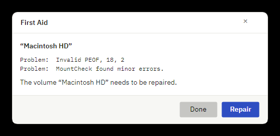
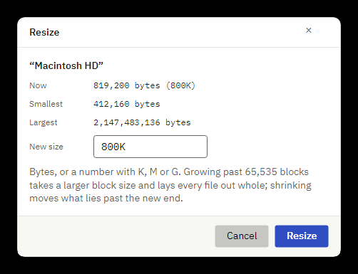
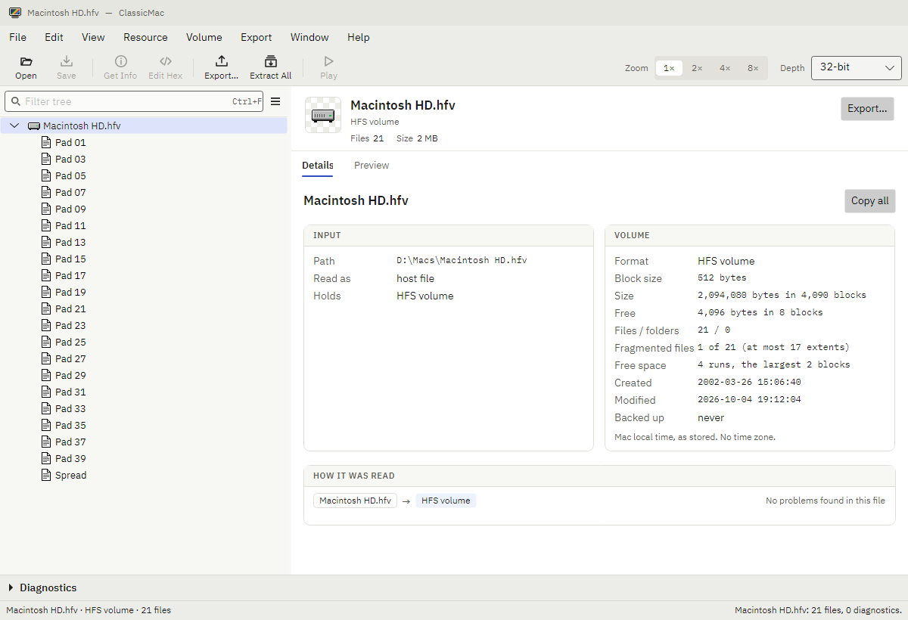

# Volume tools: design request

Date: 2026-10-04. A request for a board (`design/boards/volume-tools.md`, with frames in light, dark and 150%) covering
the app's whole-volume commands and the Volume card. They were built on the existing dialog frame
([boards/dialogs.md](../boards/dialogs.md)) and the Details cards ([boards/details.md](../boards/details.md)) without a
board of their own. The screenshots here show them as they are today.

## What the user can do now

The **Volume** menu, on a writable HFS volume (a plain image, a partition, a Disk Copy or NDIF image):

| Item | Does | Today |
| --- | --- | --- |
| New File…, Import File…, New Folder… | make an item in the selected folder | dialogs on the board |
| Delete File or Folder… | removes the selection | Yes/No confirmation |
| First Aid… | checks the volume as Disk First Aid 8.5.5 does; Repair repairs it | the First Aid window (below) |
| Defragment | lays the volume out again: every file in one piece, the free space in one run | no dialog: runs at once, one status line |
| Resize… | grows or shrinks a plain volume image | the Resize dialog (below) |

All of them change the volume in memory: the title gets "•", and Save As ▸ HFS Volume Image writes the result. The
tree's context menu offers First Aid, Defragment and Resize on any item of the volume too. An HFS Plus volume has only
First Aid; a partition has no Resize (its map would change).

## Screens

**First Aid** ([dialog-first-aid-light.png](dialog-first-aid-light.png)): the volume, Disk First Aid's problem lines
in mono, the verdict, Done and Repair (offered only when it can repair). After Repair the same window lists what was
repaired, then what the check after it found.

**Resize** ([dialog-resize-light.png](dialog-resize-light.png)): the size now, the smallest it shrinks to (its blocks
in use), the largest (2 GB), and the new size as text ("800K", "20M", bytes). A size it cannot take is reported only in
the status line after the dialog closes.

**Volume card** ([light](volume-card-light.png), [dark](volume-card-dark.png)), on the input or a disk image's node:
format, block size, size and free space in bytes and blocks, files and folders, how many files lie in more than one
piece and how the free space lies, then the volume's dates.

## Questions

1. **The Volume menu.** One flat list today. Should file items (New File, Import, New Folder, Delete) and volume
   maintenance (First Aid, Defragment, Resize) be separate groups, or the maintenance a submenu? Which belong in the
   tree's context menu?
2. **Long operations.** First Aid, Defragment and Resize take seconds on a large volume (up to 2 GB) and show nothing
   while they run. A progress state in the window, in the status bar, or a sheet? Can they be cancelled?
3. **Defragment.** Should it explain itself first (what it does, that it rewrites every file's place), show the
   fragmentation before and after, or stay a one-click command? It is the answer when a shrink is refused for want
   of free space.
4. **Resize.**
   - Text with units, a number with a unit picker, or a slider between smallest and largest?
   - Errors in the dialog (not a size, too small, too large) rather than after it closes.
   - Two consequences need saying: growing past 65,535 blocks picks a larger block size and lays every file out again
     (a defragmentation); shrinking below what the free space allows is refused until the volume is defragmented.
5. **First Aid.**
   - The verdict's weight: appears to be OK, needs repair, cannot repair. Icon, colour, or text only?
   - Problems and repairs in one list or two.
   - Copying the report.
6. **The Volume card.**
   - The labels are long for the 90 px column ("Fragmented files").
   - Would a used/free bar (like the fork bars on the Forks card) say more than the bytes?
   - Should fragmentation get a small free-space map, and a Defragment action on the card when there is something to
     gain?

## Constraints

- Tokens only ([TOKENS.md](../TOKENS.md)); the dialog frame of [boards/dialogs.md](../boards/dialogs.md); codes,
  sizes and Disk First Aid's lines in mono.
- Frames in light, dark and 150%, as the other boards.
- The commands stay session edits written by Save As; nothing is written to the image until then.
