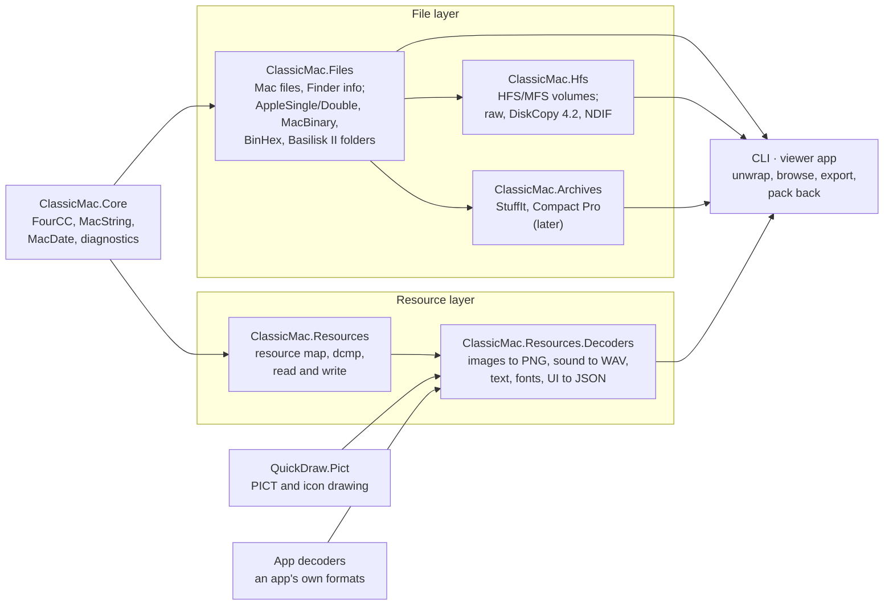

# ClassicMac — Project Plan

As of 2026-09-27.

## Purpose and goals

A .NET library, command-line tool and desktop app that gets the resources out of classic Mac OS files — whatever
they are wrapped in — and turns them into modern files with a manifest, and later edits and writes them back.

- **Reach the fork.** Read resource forks from raw forks, AppleDouble/AppleSingle, MacBinary, BinHex and, later, HFS
  disk images and old archives.
- **Decode, faithfully.** Convert each resource type to a modern format the way the Mac would have shown it: images
  through QuickDraw.Pict, sound to WAV, text to UTF-8, fonts, and UI resources to JSON.
- **Stay dependency-free at the core**, like QuickDraw.Pict, so other tools can embed it.
- **Stand alone.** A general tool for anyone working with classic Mac files; applications with their own formats
  extend it through custom decoders.

**Name and repository (decided):** the project is **ClassicMac**, in its own GitHub repo `inexin/ClassicMac` holding
the libraries, the CLI and the viewer/editor app. Packages: `ClassicMac.Core`, `ClassicMac.Files`,
`ClassicMac.Hfs`, `ClassicMac.Archives`, `ClassicMac.Resources`, `ClassicMac.Encodings`,
`ClassicMac.Resources.Decoders`, `ClassicMac.Resources.Cli`; the app carries the same name. QuickDraw.Pict stays a
separate repo and package for now; merging it into ClassicMac (as `ClassicMac.QuickDraw` and `ClassicMac.Pict`) is the
long-term intent.

## Inputs

Resource forks rarely survive on modern disks, so most of the value is in unwrapping the containers they travel in.
Proposed priority:

| Priority | Container | Typical source |
| --- | --- | --- |
| 1 | Raw resource fork (`.rsrc`, `file/..namedfork/rsrc` on macOS) | Extracted forks, macOS copies |
| 1 | AppleDouble (`._file`, `__MACOSX/` in zips) and AppleSingle | Files copied to FAT/SMB, zip archives |
| 1 | Basilisk II / SheepShaver shared folders (`.rsrc/<name>` fork, `.finf/<name>` Finder info) | Files copied out of emulators |
| 1 | MacBinary I/II/III (`.bin`) | Downloads, archive sites |
| 1 | BinHex 4.0 (`.hqx`) | Usenet, old download sites |
| 2 | HFS and MFS disk images: raw `.dsk`/`.img`, DiskCopy 4.2, NDIF | Emulator disks, floppy images, CD-ROMs |
| 3 | HFS+ images | Mac OS 8.1–9 disks |
| 3 | StuffIt (`.sit`) and Compact Pro (`.cpt`) archives | Most classic Mac downloads |

Containers can nest (a `.hqx` holding a `.sit` holding a disk image), so input detection should recurse.

Every container yields the same *Mac file* entry (`MacFile`, in `ClassicMac.Files`): name (MacRoman), type and
creator, Finder flags, creation and modification dates (seconds since 1904, local time), data fork and resource fork.
Single-file containers yield one entry; disk images and archives yield a tree of them.

**File layer and resource map are separate packages (decided).** Containers wrap whole Mac files (both forks and
Finder info), not resource forks, so they live apart from the resource map: `ClassicMac.Files` (the file model and the
single-file wrappers), `ClassicMac.Hfs` (volumes and disk images) and later `ClassicMac.Archives` (StuffIt, Compact
Pro).
People who only unpack old downloads or disk images don't need the resource map, people who only edit resource forks
don't need the containers, and each package stays smaller to test and fuzz. The types both sides use — `FourCC`
(types, creators, resource types), `MacString` (file and resource names), `MacDate` (file and volume dates, and the
1904-based dates inside resource data such as QuickTime headers) and `Diagnostic` — live in a small shared base,
`ClassicMac.Core`, so neither side depends on the other.

## Core: the resource map

`ClassicMac.Resources` reads a resource fork into an in-memory model and writes one back.

- **Model:** file → types → resources; each resource has type, ID, name, attributes (system heap, purgeable, locked,
  protected, preload, compressed) and its data.
- **Finder info:** belongs to the file (`FinderInfo` in `ClassicMac.Files`), not the fork; the manifest records it
  beside the fork's resources.
- **Compressed resources:** the System's `dcmp` 0, 1, 2 and 3 decompressed natively
  (`ResourceDecompression`). 0, 1 and 2, and the Resource Manager's handling (header, in-place block, working buffer,
  failures), follow the disassembly of the ROM $077D and Mac OS 9.0 code; `dcmp` 3 (bit-stream LZ77, used by every
  compressed Mac OS 9 System resource) is ported from resource_dasm and marked behavioural until it is traced.
  Malformed-input behaviour follows Mac OS 9 by default, the 68k ROM when `ReadOptions.ResourceManager` says so.
  Where the Mac has no bounds (memo tables, in-place overlap) the result is reproduced, and an overrun stops with a
  diagnostic. Unknown `dcmp` IDs are kept compressed and flagged in the manifest; applications can add decompressors.
- **API shape:** read from a `Stream` or memory. A fork's 24-bit data offsets cap it at 16 MiB of data, so a fork is
  loaded whole and each resource's data is a slice of that buffer; laziness lives one level up, in `ForkData`, so
  disk images stay cheap to open.
- **Canonical writing (decided):** the writer always produces one compact layout — header, reserved areas, data in
  type then resource order, the map with its type list at 28, reference lists, then names. Real forks carry gaps,
  stale bytes and runtime values, so round trips are judged on the model; forks already in canonical layout come
  back byte for byte. The layout is fitted to real files, to be checked against Rez and the Resource Manager.
- **Duplicates (decided):** a damaged fork with two resources of the same type and ID keeps the first, as
  `GetResource` would, and reports the rest.
- **Tolerant reading:** truncated or overlapping entries go to a diagnostics list (severity, offset, message), not
  exceptions; only unusable input throws.
- **Writing:** rebuild a fork from the model, for modding and round-trip tests.
- **Text encodings:** MacRoman by default; the script of a file or of a font picks other Mac encodings (Japanese,
  Cyrillic, …). See [Text encodings](#text-encodings).
- **Untrusted input:** see [Hostile input](#hostile-input).

### Text encodings

.NET has no Mac encodings built in (`CodePagesEncodingProvider` must be registered and does not cover every Mac
script), so ClassicMac ships its own tables, generated from Unicode's published Apple mapping files (Unicode licence,
noted in `THIRD-PARTY-NOTICES.md`).

- **`ClassicMac.Core`:** MacRoman and the single-byte Mac scripts (Central European, Cyrillic, Greek, Turkish,
  Icelandic, Croatian, Romanian, Symbol, Dingbats) beside `MacString`, which both file names and resource names use;
  small enough to keep the base dependency-free.
- **`ClassicMac.Encodings`:** the multi-byte scripts (Japanese, Traditional and Simplified Chinese, Korean), optional
  because their tables are large.
- **Choosing the script:** an explicit `--encoding` wins; otherwise the font's script (`FOND` family ID range), then
  the file's region (`vers`), then MacRoman. The choice is recorded in the manifest.
- MacRoman ↔ Unicode is lossless (every byte maps to one code point), so names and four-character codes stored as
  text round-trip exactly.

### Hostile input

The readers parse arbitrary downloaded files, so every size and offset is checked before use.

- **Bounds:** offsets and lengths are checked against the stream before reading; anything outside goes to diagnostics.
- **Allocation limits:** a per-resource ceiling on decompressed size; `dcmp` output must match the size its header
  declares; decoders check image dimensions against a pixel ceiling before allocating.
- **Nesting and cycles:** container recursion stops at a depth limit; HFS B-tree and extent walks detect cycles.
- **Fuzzing:** SharpFuzz with libFuzzer on each container reader, the resource map and `dcmp`, seeded from the test
  fixtures; a short run on every CI build, a longer one nightly; crashes become regression fixtures.

### Configuration

No tunable value is hard-coded: every limit and default lives as a property on an options object, with its default
documented there, and the CLI flags and the app's settings map onto the same objects.

| Options object | Package | Settings (default) |
| --- | --- | --- |
| `ContainerReadOptions` | Files | Max container nesting depth (8), max total bytes expanded per input (1 GiB) |
| `ReadOptions` | Resources | Max decompressed resource size (64 MiB), Resource Manager model (Mac OS 9), text encoding override (none) |
| `DecodeOptions` | Decoders | Max image pixels (64 megapixels), screen depth (32-bit), make fonts loadable (off) |
| `ExportOptions` | Resources | Max output path length (200 characters), keep raw data (off) |
| `PackOptions` | Resources | Base fork (none), allow deletes (off) |

Options objects are immutable records with `with` for changes, so one instance can be shared across threads; the
defaults are a static `Default` on each. Each object arrives with the code that uses it; the encoding override joins
`ReadOptions` with the encodings.

### Core API

The model, by package (namespaces match package names). `ResourceFork.Read` and `ResourceFork.Write`/`ToArray` read
and write a fork; `ResourceDecompression` returns a resource's data as the Resource Manager would:

| Package | Type | What it is |
| --- | --- | --- |
| Core | `FourCC` | A four-byte code (type, creator, resource type); exact, case-sensitive comparison |
| Core | `MacString` | A Pascal string's raw bytes; decoded to Unicode only with the file's encoding, so round trips are exact |
| Core | `Diagnostic` | Severity, stable code, message, offset |
| Core | `MacDate` | Seconds since 1904 in the writer's local time; converts to a `DateTime` of unspecified kind |
| Files | `FinderInfo`, `FinderFlags` | `FInfo` fields and the raw 16 bytes of `FXInfo` |
| Files | `MacFile` | Name, Finder info, dates, and both forks as `ForkData` (opened on demand) |
| Files | `IContainerReader` | One per container format: `CanRead(stream)`, `Read(stream, options, diagnostics)` |
| Files | `ContainerReadOptions` | Unwrapping limits (see Configuration) |
| Resources | `Resource` | Type, ID, optional name, attributes, and data as stored (a slice of the fork read) |
| Resources | `ResourceFork` | Resources in read order, map attributes, the reserved header areas and the map's runtime handle and file reference (kept so such forks round-trip exactly); add, remove, renumber, find |
| Resources | `ResourceDecompression`, `IResourceDecompressor` | `dcmp` 0–3 and app-supplied decompressors |
| Resources | `ReadOptions` | Resource-reading limits and the Resource Manager model (see Configuration) |

A resource fork travels from the file layer to the resource map as bytes (`MacFile.ResourceFork` → `ResourceFork.Read`),
so the two packages need no reference to each other; a convenience overload taking a `MacFile` can be added to
`ClassicMac.Resources` later if it earns a dependency on `ClassicMac.Files`.

- **Mutable model, immutable records:** `ResourceFork` and `Resource` are mutable, because the editors change them;
  everything describing a file (`MacFile`, `FinderInfo`, options) is an immutable record. The model is not
  thread-safe.
- **Uniqueness enforced:** a fork holds one resource per type and ID, and a resource belongs to one fork at a time.
- **Order kept:** resources stay in the order read, and the reserved header areas are kept, so a canonical fork is
  written back byte for byte.

### CLI

A `dotnet tool` (package `ClassicMac.Resources.Cli`, command `classicmac`) built on System.CommandLine.

| Command | Does | Options | Phase |
| --- | --- | --- | --- |
| `info <input>` | Container chain, Finder info, fork sizes | — | 1 |
| `list <input>` | Files and resources inside the input | `--format text\|json` | 1 |
| `extract <input>` | Resources into a folder with a manifest | `-o <dir>`, `--raw`, `--keep-raw`, `-t <type>` (repeatable), `--overwrite`; later `--depth`, `--encoding` | 1 (raw), 3 (decoded) |
| `pack <dir>` | Rebuild a fork or container from a folder and manifest | `-o <file>`, `--base <fork>`, `--allow-deletes`, `--container raw\|appledouble\|applesingle\|macbinary\|binhex` | 5 |

- **Every command:** `--max-resource-size` maps onto `ReadOptions`, `--max-nesting-depth` and `--max-expanded-bytes`
  onto `ContainerReadOptions` (sizes in bytes or KiB/MiB/GiB), defaults taken from each record's `Default`;
  `--strict` makes warnings fail; `-q` prints errors only. The CLI references Files and Resources.
- **Exit codes:** 0 success (warnings printed); 1 part of the input could not be read (or warnings with `--strict`);
  2 usage error; 3 input not recognised or unusable; 4 file-system error; 70 command not built yet.
- **Output:** results to stdout, diagnostics to stderr, so `list --format json` can be piped.

## Decoders

Each decoder turns one resource type into a modern file; anything without a decoder is exported raw.

| Group | Resource types | Output |
| --- | --- | --- |
| Images | `PICT`, `ICON`, `ICN#`, `ics#`, `icl4/8`, `ics4/8`, `cicn`, `CURS`, `crsr`, `PAT `, `PAT#`, `ppat`, `SICN`, `icns` | PNG, via QuickDraw.Pict (screen depth selectable) |
| Sound | `snd ` (sampled formats 1/2; MACE 3:1/6:1, IMA4, µ-law) | WAV |
| Text | `STR `, `STR#`, `TEXT` + `styl`, `vers` | UTF-8 text / JSON; styled text as RTF or Markdown |
| Fonts | `sfnt`; `NFNT`/`FONT` + `FOND` | TTF; BDF or a PNG strike + metrics JSON |
| UI | `MENU`, `MBAR`, `DLOG`, `DITL`, `ALRT`, `WIND`, `CNTL` | JSON, optionally a rendered preview of the dialog |
| Colour | `clut`, `pltt` | JSON and `.act` palettes |
| Finder | `BNDL`, `FREF`, `SIZE` | JSON |
| Unknown | anything else, including `CODE` | raw `.bin` + hex preview in the manifest |

Disassembling `CODE` is out of scope; resource_dasm covers it.

App-specific types (a game's data records, an application's private resources) plug in as custom decoders
registered by the application.

## Output

One folder per input file, one subfolder per resource type, and a manifest that describes everything.

```
MyApp/
  manifest.json
  PICT/128 Title Screen.png
  snd%20/200 Door.wav
  STR#/1000 Messages.json
  CODE/1.bin
```

- **Images:** 32-bit RGBA PNG by default; `--depth` renders at a chosen screen depth (1, 2, 4, 8, 16 bit).
- **Round trip:** a `pack` command rebuilds a resource fork from the folder and manifest (below).

### Names on disk

Folder and file names must be valid and distinct on Windows, macOS and Linux. The manifest, not the name, is the
authority: `pack` reads type, ID and name from it, so escaping only has to be safe and readable, never reversible.

- **Resource files:** `<id> <name>.<ext>`, or `<id>.<ext>` when unnamed; the name is converted to Unicode through the
  file's encoding and cut so the whole path stays within the configured maximum (see Configuration).
- **Escaping:** `%XX` (the byte in the file's encoding) for control characters, `% / \ : * ? " < > |`, and a trailing
  space or dot — so `snd ` becomes `snd%20` and `PAT ` becomes `PAT%20`.
- **Reserved Windows names:** a name that matches `CON`, `PRN`, `AUX`, `NUL`, `COM1`–`COM9` or `LPT1`–`LPT9`
  (ignoring case and extension) gets its last character escaped: `COM1` → `COM%31`.
- **Case collisions:** types are case-sensitive but Windows and macOS disks are not. When two types in one fork fold
  to the same name (`PICT` and `pict`, `snd ` and `SND `), each of them gets `~` and the type's hex bytes appended:
  `PICT~50494354`, `pict~70696374`. Types without a collision keep their plain name, so output stays readable.

### Manifest

`manifest.json` is a versioned format, because `pack` and other tools depend on it.

- **Schema:** a JSON Schema per major version in the repo (`schemas/manifest-1.schema.json`), referenced by the
  manifest's `$schema` and `formatVersion` fields. New optional fields are a minor change; anything else is a new
  major version. Readers reject a newer major version and ignore unknown fields.
- **Contents:** the source (container chain, file name), Finder info, encoding used, and diagnostics; then per
  resource: type (as text), ID, name, attributes, original size, `dcmp` ID if compressed, decoder and its version,
  output path (relative, `/`-separated), SHA-256 of the raw data and of the output file, and warnings.
- **Pack rules:** a file whose hash is unchanged takes the original raw data, from `raw/` (written by
  `extract --keep-raw`; three characters, so it never clashes with a type folder) or from the original fork given with
  `--base`; a changed file is re-encoded by its decoder's encoder, or is an error if there is none.
  Resources in the manifest with no file are dropped only with `--allow-deletes`.

## Architecture and packaging

A shared base, a file layer and a resource layer, then decoders and the tools on top, so each part can be embedded on
its own and the heavy dependencies stay optional. Arrows point from a package to what uses it.



- **ClassicMac.Core** — `FourCC`, `MacString`, `MacDate`, `Diagnostic` and (later) the single-byte text encodings; no
  dependencies, .NET 10.
- **ClassicMac.Files** — the Mac file model (`MacFile`, `FinderInfo`, `ForkData`, `IContainerReader`) and
  the single-file wrappers: AppleSingle, AppleDouble, MacBinary, BinHex, Basilisk II folders; depends on Core.
- **ClassicMac.Hfs** — HFS and MFS volumes and the disk images that hold them (raw, DiskCopy 4.2, NDIF); depends on
  Files.
- **ClassicMac.Archives** — StuffIt and Compact Pro, later; depends on Files.
- **ClassicMac.Resources** — the resource map and `dcmp`; depends on Core only (Files only if a convenience overload
  ever needs it).
- **ClassicMac.Encodings** — the multi-byte Mac text encodings; optional, depends on Core.
- **ClassicMac.Resources.Decoders** — the built-in decoders; depends on Resources and QuickDraw.Pict for images.
- **CLI** — a `dotnet tool` with `info`, `list`, `extract` and `pack`; references the file and resource packages.
- **Viewer app** — a cross-platform desktop app on the same packages (below).
- **Extension points:** an `IContainerReader` per container format and an `IResourceDecoder` per resource type, so
  apps add their own.
- **Own core (decided):** the resource map and disk-image layers are written here, because writing and exact Apple
  behaviour are needed throughout; ResourceForkReader, HfsReader and MfsReader (read-only) serve as cross-checks.

### Repository layout and build

```
ClassicMac.slnx
global.json                 .NET 10 SDK, rolling forward to the latest feature band
Directory.Build.props       shared settings (below) and package metadata
Directory.Packages.props    every package version, in one place
src/ClassicMac.<Package>/   one folder per package; the app goes in src/ClassicMac.App/
                            today: Core, Files, Resources, Resources.Cli (Hfs in phase 2, Archives later)
tests/ClassicMac.<Package>.Tests/   one test project per package
tests/fixtures/             synthetic fixtures (and their Rez sources)
schemas/                    manifest JSON Schemas
tools/                      fixture and table generators; never packed
```

- **Every project:** `net10.0`, nullable enabled, warnings as errors, implicit usings off, deterministic builds.
- **Projects under `src/`:** XML documentation, `IsAotCompatible` (trimming and AOT analysers on), so the CLI can
  publish as a native executable; tests and tools are never packable.
- **Packages** are referenced without versions; `Directory.Packages.props` holds them.
- **CI:** `dotnet test` on Windows, Linux and macOS for every push; fuzzing and the Rez hash check join as they arrive.

### Target layering after the QuickDraw.Pict merge

When QuickDraw.Pict moves into ClassicMac, it is split so every dependency points down: QuickTime and MacPaint stop
living inside PICT, PICT calls QuickTime for its embedded images (`$8200`/`$8201`), and the QuickDraw renderer is
separated from the PICT file format. Until the merge, QuickDraw.Pict stays one package, but its code already
follows this split in layer folders (`Graphics/`, `MacPaint/`, `QuickTime/`, `QuickDraw/`, `Pict/`, `Resources/`),
with a test that fails on any dependency pointing up; the merge moves those folders into projects.

| Layer | Contains | Depends on |
| --- | --- | --- |
| `ClassicMac.Graphics` (base) | The RGBA bitmap type, standard colour tables (`clut` 1–8, greys), PackBits, colour-table and PixMap reading | nothing |
| `ClassicMac.QuickTime` | ImageDescription, the codecs (`raw `, `rle `, `rpza`, `smc `, `cvid`, `8BPS`, `yuv2`, `YVU9`, `tga `), the codec plugin hook, QTIF files | Graphics, MacPaint (its `PNTG` codec) |
| `ClassicMac.MacPaint` (or inside Graphics) | PNTG files and the `PNTG` codec's decoder | Graphics |
| `ClassicMac.QuickDraw` | The renderer: GrafPort state, regions, shapes, patterns, transfer modes, CopyBits/StretchBits, text drawing, screen depths, with a public drawing API (`FrameRect`, `PaintRgn`, `CopyBits`, `DrawText`, …) on a canvas | Graphics (and font parsing, see open questions) |
| `ClassicMac.Pict` | The PICT file format: the opcode reader that replays a picture into the renderer, and the writer | QuickDraw, QuickTime |
| `ClassicMac.Core`, `ClassicMac.Files`, `ClassicMac.Hfs`, `ClassicMac.Archives` | The shared base and the file layer (unchanged by the merge) | Core; the file packages on Files |
| `ClassicMac.Resources` (+ `.Decoders`) | Resource forks; icons, cursors and patterns become resource decoders here | Core; the decoders on Graphics, QuickDraw |
| `ClassicMac.ImageSharp`, `ClassicMac.SkiaSharp` | One integration package per host library, covering every image format (PICT, QTIF, MacPaint, icons) | the layers above |

Colour tables and PixMaps sit in the base because QuickTime's codecs and QuickDraw both need them. At the merge,
`QuickDraw.Pict`, `QuickDraw.Pict.ImageSharp` and `QuickDraw.Pict.SkiaSharp` are deprecated on NuGet, pointing to
the new packages.

**Renderer and file format are separate (decided).** A picture is a recording of QuickDraw calls, which is why the two
grew up together, but other parts need the renderer without PICT: dialog previews drawn from `DLOG`/`DITL` the way the
Dialog Manager draws them, icons scaled with CopyBits, `cicn` masks, cursors and patterns at a screen depth, and any
later QuickDraw GX or 3DMF work reusing regions and colour. Exposing the renderer's drawing API (today internal and
shaped around PICT playback) is part of the merge work. The specification splits the same way: QuickDraw.Pict's
`PICT-FORMAT.md` becomes `docs/formats/PICT.md` (opcodes and operands) and `docs/formats/QUICKDRAW.md` (the drawing
rules), with one spec per format under `docs/formats/`.

**Where icons live (settled by this layering):** icons, cursors and patterns are resources, so their decoders go in
`ClassicMac.Resources.Decoders`. Plain decoding (`ICN#`, `icl8`, `cicn`, …) needs only Graphics (colour tables,
PixMaps, masks); QuickDraw is needed only to scale them or draw them at a screen depth. The Icon Utilities rules that
QuickDraw.Pict's spec describes but never implemented move here too — suite member choice by size and depth, the
selected/disabled/label transforms, CalcMask, the `cicn` bitmap-or-pixmap rule — as does `icns` (Mac OS X icons).

### Viewer app

A desktop app for Windows, Linux and macOS to browse disk images, archives and files, and open their resource forks —
like ResEdit, read-only at first.

- **Framework:** [Avalonia](https://avaloniaui.net) — decided. The libraries are .NET, so the UI calls them directly
  with no bridge; one codebase ships as a self-contained download per OS (about 30–60 MB); it draws with Skia, so
  previews render pixel-identical everywhere. Rejected: Electron/Tauri (a web UI only pays off for a browser version,
  which the libraries could later reach through WebAssembly on their own), .NET MAUI (no Linux desktop), and a native
  UI per platform (three UIs).
- **Browse:** open a disk image, archive or file; a tree of volumes → folders → files, showing type/creator, dates and
  both forks; nested containers open in place.
- **Resources:** a file's resource fork as types → resources, with ID, name, size and attributes; search by type, ID
  or name.
- **Previews:** images (with a screen-depth switch), text, sound playback, font glyph sheet, dialogs drawn from
  `DLOG`/`DITL`, and a hex view for everything.
- **Export:** selected resources, a whole file or a whole volume, through the same code as the CLI; drag and drop out
  of the app.
- **Later:** editing, in stages (below), starting once `pack` round-trips cleanly.

**Structure:** the app adds nothing format-specific — it sits on the same `ClassicMac.Resources` and `Decoders`
packages as the CLI. MVVM with plain C# view-models (testable without a UI), one preview control per kind (image, hex,
text, sound, font, dialog) chosen by resource type, lazy opening and decoding so large disk images browse instantly;
sound playback is the only native dependency.

**First version:** read-only — open a file or disk image, browse the tree, preview images and hex, export. Other
previews arrive with their decoders.

**Editing, in three stages** — the viewer becomes an editor, ResEdit-style. Every save writes a verified round trip
(read back and compared) and keeps the original; undo within a session.

1. **Resource-level edits:** add, delete, duplicate, renumber and rename resources, change attributes, replace a
   resource's data from a file or the hex editor; save back into the same container (raw fork,
   AppleDouble/AppleSingle, MacBinary, BinHex).
2. **Typed editors:** forms for `STR `, `STR#`, `TEXT`/`styl`, `vers` and the UI templates (`DLOG`, `DITL`, `MENU`,
   …) with a live dialog preview; import PNG as PICT, icons and cursors, and WAV as `snd ` — which needs encoders in
   the libraries.
3. **Writing disk images:** add, replace and delete files in HFS images, with type/creator, dates and both forks.
   Archives (StuffIt, Compact Pro) stay read-only.

## Ground truth and licensing

Apple's documentation decides first; where it is silent or ambiguous, the answer comes from disassembling the Mac OS
code that handles the format (the Resource Manager, Sound Manager, Icon Utilities, HFS) — never from another
implementation's guess. A rule fitted to real data instead is marked as such.

- **Specs:** *Inside Macintosh: More Macintosh Toolbox* (resource format), *Inside Macintosh: Files* (HFS, MFS),
  *Sound* (`snd `), the Apple file-format notes for MacBinary, AppleSingle/AppleDouble and BinHex 4.0.
- **Behavioural references, not code to copy:** resource_dasm (MIT) and other open tools for container and `dcmp`
  edge cases.
- **Licence:** MIT, with third-party notices for anything ported; no Apple code or files in the repo.

### Testing

- **Fixtures in the repo are synthetic:** built by our own writer inside the tests, or from Rez source compiled with
  Apple's Rez through `mpw` (the output is ours, not an Apple file).
- **Rez fixtures are compiled locally, not in CI:** MPW is Apple software and never enters the repo or CI. The `.r`
  source and the compiled fork are both committed; a script regenerates them on a machine where `MPW_ROOT` points to
  an MPW install and records each source's hash beside its fork; CI checks the hashes so a stale fork fails the build.
- **Real-file corpus outside the repo:** system files, applications, games such as Realmz, shareware — found through
  an environment variable (`CLASSICMAC_CORPUS`); those tests skip when it is absent. Only hashes and manifests of
  corpus results are committed, never the files or their decoded output.
- **Checks:** round trip (read → write → read gives the same model, and canonical forks are byte-identical); golden
  outputs for each decoder on the synthetic fixtures; corpus output diffed against resource_dasm and DeRez.
- **Tooling:** xUnit v3 on Microsoft.Testing.Platform (`dotnet test --solution ClassicMac.slnx`); CI on GitHub
  Actions for Windows, Linux and macOS.

### Prior art: Realmz.ResourceExtractor

The resource extractor in the Realmz project (a separate game reimplementation) is inspiration, not an authority: its
rules were written for Realmz's files and must be re-checked against Apple's documentation or the disassembly before
they are carried over. ClassicMac does not depend on Realmz; Realmz's data files are one of the test corpora, and the
Realmz project can serve as a real-world consumer to try the libraries against.

| Area | What it does today | Take from it |
| --- | --- | --- |
| Input | Raw resource-fork files (`.rsf`) only | The resource map reader, as a first draft |
| Resource map | Types, IDs, data; names not read; no `dcmp` | Needs names, attributes and compression |
| Images | PICT, `cicn`, icon lists and `icl`/`ics` with their masks, cursors with hotspots, `ppat` via QuickDraw.Pict | The icon-list pairing and the hotspot JSON |
| Sound | `snd ` formats 1/2, uncompressed PCM only (MACE and IMA4 throw) | The WAV writer; codecs still to do |
| Text | `TEXT` and `STR#` (JSON, 0-based) in MacRoman | The `STR#` layout |
| Fonts | `sfnt` → TTF, adding a Windows Unicode `cmap` and a missing `OS/2` table so modern loaders accept it | A "make it loadable" option for exported fonts |
| UI | `DLOG`, `DITL`, `WIND`, `CNTL`, `MENU`, `MBAR` → JSON | The field layouts, re-checked against *Inside Macintosh* |
| Output | A folder per category (`pictures/`, `sounds/`, …), 5-digit IDs, no manifest | Replace with per-type folders and a manifest |

### Prior art: other projects

No existing project combines containers, faithful conversion, writing and a cross-platform GUI — but each covers a
slice worth learning from. Licences matter: MIT code may be reused with notice; GPL and LGPL code is reference only.

| Project | Language, licence | Covers | Use for us |
| --- | --- | --- | --- |
| [ResourceForkReader](https://github.com/hughbe/ResourceForkReader) | C#, MIT; NuGet, active since 2025 | Reads raw forks; typed parsers for ~130 resource types; no `dcmp`, containers, conversion or writing | Cross-check record layouts and parsing |
| [HfsReader](https://github.com/hughbe/HfsReader) / [MfsReader](https://github.com/hughbe/MfsReader) | C#, MIT; NuGet | Read HFS and MFS disk images | Cross-check for the disk-image layer |
| [macresources](https://github.com/elliotnunn/macresources) | Python, MIT; dormant since 2020 | Rez-style text dumps, round trip, BinHex, `dcmp` 2 (GreggyBits) | Round-trip design; `dcmp` 2 reference |
| [machfs](https://github.com/elliotnunn/machfs) | Python, MIT | Reads and writes HFS volumes | Reference for writing HFS images |
| [resource_dasm](https://github.com/fuzziqersoftware/resource_dasm) | C++, MIT; very active | Decodes a very wide range of resource types to modern formats; `dcmp` via 68k emulation; disassembly | Widest coverage to compare output against |
| Claunia.RsrcFork (Aaru) | C#; NuGet, ~16k downloads | Resource fork reading for the [Aaru](https://github.com/aaru-dps/Aaru) preservation suite | Cross-check; Aaru for disk-image formats |
| [HFSExplorer](https://github.com/unsound/hfsexplorer) | Java, GPL-3 | GUI browser for HFS/HFS+ images, extracts both forks | UX reference for the viewer |
| [XADMaster](https://github.com/MacPaw/XADMaster) | C/Objective-C, LGPL-2.1 | The Unarchiver's engine: StuffIt, Compact Pro, BinHex, MacBinary | Reference for archive formats |
| [mpw](https://github.com/ksherlock/mpw) | C | Runs Apple's MPW tools (Rez, DeRez) on modern systems | Ground truth: compile/decompile with Apple's own Rez |
| [ResourceForker](https://github.com/csammis/ResourceForker) | C; dormant since 2016 | Small utilities to split resource forks | Minor reference |

## Phases

Each phase ships something usable and ends when its exit check passes; no dates set yet.

1. **Core** — `ClassicMac.Core`; `ClassicMac.Resources`: resource map read/write, `dcmp` 0/1/2/3;
   `ClassicMac.Files`: Finder info, AppleDouble/AppleSingle, MacBinary, BinHex, Basilisk II shared folders; raw forks;
   CLI `list` and raw `extract`. *Exit:* read → write → read gives the same model on every corpus fork, and canonical
   forks come back byte for byte.
2. **Disk images** — `ClassicMac.Hfs`: HFS and MFS (raw, DiskCopy 4.2, NDIF); recursive unwrapping across Files and
   Hfs. *Exit:* every file of the corpus images lists and extracts with both forks and Finder info.
3. **Decoders I** — images through QuickDraw.Pict; text (`STR `, `STR#`, `TEXT` + `styl`, `vers`); `snd ` to WAV
   including MACE and IMA4; the manifest. *Exit:* golden outputs pass and the corpus exports without errors.
4. **Viewer app** — read-only: browse disk images, files and resources with previews and export; grows with later
   decoders.
5. **Decoders II** — UI resources to JSON and dialog previews, then fonts; palettes and Finder resources; `pack`.
   *Exit:* extract → `pack` is byte-identical for unchanged resources.
6. **Editor I** — resource-level edits and saving back into forks and single-file containers.
7. **Editor II** — typed editors and PNG/WAV import (image and sound encoders).
8. **Editor III** — writing HFS disk images.
9. **Merge** — QuickDraw.Pict moves into the ClassicMac repo, split into the target layering (Graphics, QuickTime,
   MacPaint, the QuickDraw renderer with a public drawing API, the PICT format, one ImageSharp and one SkiaSharp
   package); the old packages are deprecated.
10. **Later** — HFS+ (`ClassicMac.Hfs`), StuffIt and Compact Pro (`ClassicMac.Archives`).

## Decisions

- **Name:** ClassicMac (see Purpose and goals).
- **Repository:** a new repo, `inexin/ClassicMac`; QuickDraw.Pict stays separate for now, to be merged in later.
- **UI framework:** Avalonia (see Viewer app).
- **Own core:** written here rather than built on ResourceForkReader/HfsReader, which are read-only; they serve as
  cross-checks.
- **Target framework:** .NET 10 (LTS; .NET 8 support ends November 2026).
- **Disk images early:** phase 2, right after the core, because much classic software survives only as disk images.
- **Decoder priority after images:** text, sound, UI, fonts.
- **Image output:** 32-bit RGBA PNG by default; other screen depths on request.
- **Editing order:** resource-level edits, typed editors, then writing disk images.
- **Names on disk:** `%XX` escaping, reserved-name escaping, hex suffix on case collisions; the manifest is the
  authority (see Names on disk).
- **Manifest:** versioned JSON Schema; hashes decide what `pack` re-encodes.
- **Encodings:** own tables from Unicode's Apple mappings; single-byte in `ClassicMac.Core`, multi-byte in
  `ClassicMac.Encodings`.
- **Hostile input:** bounds checks, allocation and nesting limits, fuzzing in CI.
- **Resource Manager model:** Mac OS 9's behaviour is the default where it and the 68k ROM differ (only on malformed
  compressed resources); the ROM's is selectable in `ReadOptions`.
- **Configuration:** every limit and default is a property on an immutable options object
  (`ContainerReadOptions`, `ReadOptions`, `DecodeOptions`, `ExportOptions`, `PackOptions`); nothing tunable is
  hard-coded.
- **Renderer and file format:** at the merge, the QuickDraw renderer (`ClassicMac.QuickDraw`) and the PICT format
  (`ClassicMac.Pict`) become separate packages (see Target layering).
- **Integrations:** one package per host library (`ClassicMac.ImageSharp`, `ClassicMac.SkiaSharp`) covering every
  image format, instead of one per format.
- **Package naming:** `ClassicMac.<Area>`, named after the Apple technology (QuickDraw, QuickTime, Hfs); namespaces
  match package names; format specs live under `docs/formats/`.
- **Files and disk images as their own packages (split):** `ClassicMac.Files` (file model and single-file wrappers),
  `ClassicMac.Hfs` (phase 2) and `ClassicMac.Archives` (later) are separate from `ClassicMac.Resources`; the shared
  types (`FourCC`, `MacString`, `MacDate`, `Diagnostic`) sit in the dependency-free base `ClassicMac.Core` (see
  Inputs).

## Open questions

- [ ] **Fonts package:** a `ClassicMac.Fonts` package for `FONT`/`NFNT`/`FOND`/`fctb` parsing (used by the renderer's
  text and by font export), or font parsing inside `ClassicMac.QuickDraw`?
- [ ] **One or several decoder packages:** a single `ClassicMac.Resources.Decoders`, or split by area (icons, text,
  UI, sound) for users who want a small subset?
- [ ] **`dcmp` 3 in disassembly:** bit order and refill, the two length codes, the offset thresholds (including the
  two resource_dasm calls bugs in Apple's code), the literal-run rule and termination. Until then it is behavioural;
  all 34 compressed resources in the Mac OS 9.0 System decompress to their declared sizes with plausible content.
