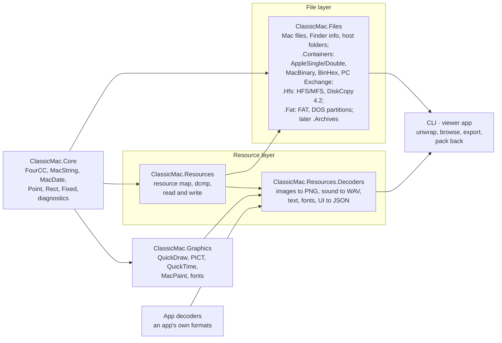

# ClassicMac — Project Plan

As of 2026-09-27.

## Purpose and goals

A .NET library, command-line tool and desktop app that gets the resources out of classic Mac OS files — whatever
they are wrapped in — and turns them into modern files with a manifest, and later edits and writes them back.

- **Reach the fork.** Read resource forks from raw forks, AppleDouble/AppleSingle, MacBinary, BinHex and, later, HFS
  disk images and old archives.
- **Decode, faithfully.** Convert each resource type to a modern format the way the Mac would have shown it: images
  through QuickDraw.Pict, sound to WAV, text to UTF-8, fonts, and UI resources to JSON.
- **Stay dependency-free at the core**, like QuickDraw.Pict, so other tools can embed it.
- **Stand alone.** A general tool for anyone working with classic Mac files; applications with their own formats
  extend it through custom decoders.

**Name and repository (decided):** the project is **ClassicMac**, in its own GitHub repo `inexin/ClassicMac` holding
the libraries, the CLI and the viewer/editor app. Packages: `ClassicMac.Core`, `ClassicMac.Files`,
`ClassicMac.Resources`, `ClassicMac.Encodings`, `ClassicMac.Graphics`, `ClassicMac.Graphics.ImageSharp`, `ClassicMac.Graphics.SkiaSharp`,
`ClassicMac.Resources.Decoders`, `ClassicMac.Resources.Cli`; the app carries the same name. QuickDraw.Pict moved into
this repo with its history on 2026-09-29 and became `ClassicMac.Graphics` (QuickDraw, PICT, QuickTime images,
MacPaint, fonts) with the two adapters (the layering below).

## Inputs

Resource forks rarely survive on modern disks, so most of the value is in unwrapping the containers they travel in.
Proposed priority:

| Priority | Container | Typical source |
| --- | --- | --- |
| 1 | Raw resource fork (`.rsrc`, `file/..namedfork/rsrc` on macOS) | Extracted forks, macOS copies |
| 1 | AppleDouble (`._file`, `__MACOSX/` in zips) and AppleSingle | Files copied to FAT/SMB, zip archives |
| 1 | Basilisk II / SheepShaver shared folders (`.rsrc/<name>` fork, `.finf/<name>` Finder info) | Files copied out of emulators |
| 1 | PC Exchange / File Exchange folders (`RESOURCE.FRK/<8.3 name>` fork, `FINDER.DAT` records) | DOS and Windows disks written by Mac OS 7.1–9 |
| 1 | MacBinary I/II/III (`.bin`) | Downloads, archive sites |
| 1 | BinHex 4.0 (`.hqx`) | Usenet, old download sites |
| 2 | HFS and MFS disk images: raw `.dsk`/`.img`, DiskCopy 4.2, NDIF (Disk Copy 6 `.img`, `.smi`), DART, UDIF `.dmg` | Emulator disks, floppy images, Apple system software, images re-shared from Mac OS X |
| 2 | CD images: ISO 9660 with Apple extensions, hybrid ISO + partition map + HFS; `.iso`/`.toast`/`.cdr`, raw `.bin` + `.cue` | Magazine, game and system CDs |
| 2 | FAT disk images with PC Exchange / File Exchange data (e.g. `RealmzClassicHD.img`) | Emulator hard disks and floppies shared with PCs |
| 3 | HFS+ images | Mac OS 8.1–9 disks |
| 2 | Zip with Mac extra fields (Info-ZIP 0x07c8, `M3`, ZipIt) and `__MACOSX/` pairing; tar/gzip (MacGzip) with `._` pairing | Modern re-uploads, Unix-era transfers |
| 3 | StuffIt 1.x–5 (`.sit`, `.sea`) and Compact Pro (`.cpt`) archives; self-extractors found by signature | Most classic Mac downloads |
| 4 | DiskDoubler (`.dd`), segmented archives (StuffIt SegmentIt, Compact Pro segments), PackIt (`.pit`) | Early 1990s downloads, multi-floppy BBS files |
| 5 | Only on request: AppleLink PackageIt, Now Compress, MacLHA, MOOF flux images, MAME CHD, Apple II formats | Rare, or not classic Mac |
| 3 | Mac ROM images: the ROM's built-in resource map (its own entry format, selected per machine) | ROM dumps for emulators |

Containers can nest (a `.hqx` holding a `.sit` holding a disk image), so input detection should recurse.

Out of scope: StuffIt X (`.sitx`, 2002+, a large proprietary format), `.sparseimage`/`.sparsebundle` (Mac OS X).

Every container yields the same *Mac file* entry (`MacFile`, in `ClassicMac.Files`): name (MacRoman), type and
creator, Finder flags, creation and modification dates (seconds since 1904, local time), data fork and resource fork.
Single-file containers yield one entry; disk images and archives yield a tree of them.

**File layer and resource map are separate packages (decided).** Containers wrap whole Mac files (both forks and
Finder info), not resource forks, so they live apart from the resource map in one package, `ClassicMac.Files`: the
file model and single-file wrappers, `ClassicMac.Files.Hfs` for HFS and MFS volumes and disk images, `ClassicMac.Files.Fat` for FAT volumes, and later
`ClassicMac.Files.Archives`.
People who only unpack old downloads or disk images don't need the resource map, people who only edit resource forks
don't need the containers, and each package stays smaller to test and fuzz. The types both sides use — `FourCC`
(types, creators, resource types), `MacString` (file and resource names), `MacDate` (file and volume dates, and the
1904-based dates inside resource data such as QuickTime headers) and `Diagnostic` — live in a small shared base,
`ClassicMac.Core`, so neither side depends on the other.

## Core: the resource map

`ClassicMac.Resources` reads a resource fork into an in-memory model and writes one back.

- **Model:** file → types → resources; each resource has type, ID, name, attributes (system heap, purgeable, locked,
  protected, preload, compressed) and its data.
- **Finder info:** belongs to the file (`FinderInfo` in `ClassicMac.Files`), not the fork; the manifest records it
  beside the fork's resources.
- **Compressed resources:** the System's `dcmp` 0, 1, 2 and 3 decompressed natively (`ResourceDecompression`),
  all four and the Resource Manager's handling (header, in-place block, working buffer, failures) following the
  disassembly of the ROM $077D and Mac OS 9.0 code; `dcmp` 3 (bit-stream LZ77, used by every compressed Mac OS 9
  System resource) was first ported from resource_dasm and then checked against it. On Mac OS 9 all decompressors run
  as 68k code (the native `ncmp` ones are never used). Malformed-input behaviour follows Mac OS 9 by default, the 68k
  ROM when `ReadOptions.ResourceManager` says so. Where the Mac has no bounds the result is reproduced: memo tables
  overwrite each other, output may overtake input in place, and the memory after the block (2 KiB, zero) takes
  `dcmp` 3's overshoot and reads past the input; anything further stops with a diagnostic. Unknown `dcmp` IDs are kept
  compressed and flagged in the manifest; applications can add decompressors.
- **Map attributes:** the word at map offset 22 is two bytes — `mAttr` (read-only, compact, changed, force system
  heap) and `mInMemoryAttr` (flags such as the decompression password bit, which some files carry on disk); both are
  kept (`ResourceFork.Attributes`, `ResourceFork.MapFlags`).
- **API shape:** read from a `Stream` or memory. A fork's 24-bit data offsets cap it at 16 MiB of data, so a fork is
  loaded whole and each resource's data is a slice of that buffer; laziness lives one level up, in `ForkData`, so
  disk images stay cheap to open.
- **Canonical writing (decided):** the writer produces what the Resource Manager's compaction leaves (UpdateResFile /
  CloseResFile, from the ROM and Mac OS 9 disassembly, checked in SheepShaver): header; the reserved areas; data items
  packed with no padding in ascending order of where they were, added or grown data after the old data, shared data
  kept shared; the map with the header copy, its runtime fields as read (zero for a new fork), attributes without
  compact and changed ($60), type list at 28, types in the order first added, references in the order added, names in
  the order set (a new name goes to the end). A new fork matches CreateResFile (286 bytes). Round trips are judged on
  the model; a fork the Mac left compacted comes back byte for byte — 142 of 152 corpus forks, and 29 of 33 forks
  written by Mac OS 9 in the harness (the rest: stale bytes left by in-place shrinking, duplicate IDs, and a fork
  OS 9 itself corrupts).
- **Duplicates (decided):** a damaged fork with two resources of the same type and ID keeps the first, as
  `GetResource` would (confirmed in the harness), and reports the rest. A type listed twice is merged (Mac OS 9's
  GetResource searches all its lists; counting and indexing see only the first).
- **Tolerant reading:** truncated or overlapping entries go to a diagnostics list (severity, offset, message), not
  exceptions; only unusable input throws. The reader also reports whether the modelled Resource Manager would open the
  fork (`fork.mac-rejects`, from Mac OS 9's vNewMap/CheckMap or the ROM's much weaker checks, matching the analysis
  model on all harness forks it reads), would read past its map (`fork.mac-misreads`), would hang (a resource count of
  $FFFF), or would misread reference lists that are not contiguous in type order.
- **Writing:** rebuild a fork from the model, for modding and round-trip tests.
- **Text encodings:** MacRoman by default; the script of a file or of a font picks other Mac encodings (Japanese,
  Cyrillic, …). See [Text encodings](#text-encodings).
- **Untrusted input:** see [Hostile input](#hostile-input).

### Text encodings

.NET has no Mac encodings built in (`CodePagesEncodingProvider` must be registered and does not cover every Mac
script), so ClassicMac ships its own tables, generated from Unicode's published Apple mapping files (Unicode licence,
noted in `THIRD-PARTY-NOTICES.md`).

- **`ClassicMac.Core`:** MacRoman (done: `MacRoman`, `MacString.FromMacRoman`/`ToMacRoman`) and the single-byte Mac
  scripts (Central European, Cyrillic, Greek, Turkish, Icelandic, Croatian, Romanian, Symbol, Dingbats) beside
  `MacString`, which both file names and resource names use; small enough to keep the base dependency-free.
  `FourCC` and `MacString` display as Mac OS Roman with control characters as `\xHH`, and `FourCC` parses that form.
- **`ClassicMac.Encodings`:** the multi-byte scripts (Japanese, Traditional and Simplified Chinese, Korean), optional
  because their tables are large.
- **Choosing the script:** an explicit `--encoding` wins; otherwise the font's script (`FOND` family ID range), then
  the file's region (`vers`), then MacRoman. The choice is recorded in the manifest.
- MacRoman ↔ Unicode is lossless (every byte maps to one code point), so names and four-character codes stored as
  text round-trip exactly.

### Hostile input

The readers parse arbitrary downloaded files, so every size and offset is checked before use.

- **Bounds:** offsets and lengths are checked against the stream before reading; anything outside goes to diagnostics.
- **Allocation limits:** a per-resource ceiling on decompressed size; `dcmp` output must match the size its header
  declares; decoders check image dimensions against a pixel ceiling before allocating.
- **Nesting and cycles:** container recursion stops at a depth limit; HFS B-tree and extent walks detect cycles.
- **Fuzzing:** SharpFuzz with libFuzzer on each container reader, the resource map and `dcmp`, seeded from the test
  fixtures; a short run on every CI build, a longer one nightly; crashes become regression fixtures.

### Configuration

No tunable value is hard-coded: every limit and default lives as a property on an options object, with its default
documented there, and the CLI flags and the app's settings map onto the same objects.

| Options object | Package | Settings (default) |
| --- | --- | --- |
| `ContainerReadOptions` | Files | Max container nesting depth (8), max total bytes expanded per input (1 GiB), time zone for UTC container dates (local), max files and folders read from one volume (1,000,000), File Exchange extension map (none), verify whole-image checksums (off) |
| `ReadOptions` | Resources | Max decompressed resource size (64 MiB), Resource Manager model (Mac OS 9), text encoding override (none) |
| `DecodeOptions` | Decoders | Text encoding (Mac OS Roman; more scripts later), line endings in text output (LF), image encoder (PNG), screen depth (32-bit), max image pixels (64 megapixels), QuickDraw model (Mac OS 9); later make fonts loadable (off) |
| `ExportOptions` | Resources | Max output path length (200 characters), keep raw data (off), types to export (all), overwrite (off), `ReadOptions` for decompression |
| `HostWriteOptions` | Files | Layout for unpacked files (AppleDouble or Basilisk II; AppleDouble), max path length (200 characters), overwrite (off), time zone for dates (local) |
| `PackOptions` | Resources | Base fork (none), allow deletes (off) |

Options objects are immutable records with `with` for changes, so one instance can be shared across threads; the
defaults are a static `Default` on each. Each object arrives with the code that uses it; the encoding override joins
`ReadOptions` with the encodings.

### Core API

The model, by package (namespaces start with the package name). `ResourceFork.Read` and `ResourceFork.Write`/`ToArray`
read and write a fork; `ResourceDecompression` returns a resource's data as the Resource Manager would:

| Package | Type | What it is |
| --- | --- | --- |
| Core | `FourCC` | A four-byte code (type, creator, resource type); exact, case-sensitive comparison |
| Core | `MacString` | A Pascal string's raw bytes; decoded to Unicode only with the file's encoding, so round trips are exact |
| Core | `Diagnostic` | Severity, stable code, message, offset |
| Core | `MacDate` | Seconds since 1904 in the writer's local time; converts to a `DateTime` of unspecified kind |
| Core | `MacPoint`, `MacRect` | QuickDraw `Point` (v, h) and `Rect` (top, left, bottom, right), read and written big-endian; used by Finder info and by many resources (`DLOG`, `DITL`, `WIND`, `PICT` frames, `cicn` bounds) |
| Core | `Fixed`, `UnsignedFixed` | 16.16 fixed-point numbers (resolutions, font metrics, QuickTime values; sound sample rates are unsigned) |
| Files | `FinderInfo`, `FinderFlags` | `FInfo` fields and the raw 16 bytes of `FXInfo` |
| Files | `MacFile` | Name, folder path inside its container (`MacPath` joins it with `:`), Finder info, dates, and both forks as `ForkData` (opened on demand) |
| Files | `ForkData` | A fork opened on demand: from bytes, a host file, or a `Slice` of another fork (no copy), so containers and disk images stay lazy |
| Files | `IContainerReader` | One per container format: `CanRead(ForkData)`, `Read(ForkData, ContainerContext)` → Mac files |
| Files.Containers | `AppleSingleReader`, `MacBinaryReader`, `BinHexReader`, `PcExchange` | AppleSingle/AppleDouble v1–v2, MacBinary I/II/III (one reader per version), BinHex 4.0, PC Exchange records |
| Files.Hfs | `HfsReader`, `MfsReader`, `DiskCopy42Reader`, `NdifReader`, `DartReader`, `UdifReader`, `PartitionMapReader` | HFS and MFS volumes (forks read in place through their extents), Disk Copy 4.2, UDIF, NDIF (chunks decoded on demand, segments joined) and DART images, Apple partition maps; each yields files the next can open |
| Files.Fat | `FatReader`, `MbrReader` | FAT12/16/32 volumes with each file's Mac name, Finder info, dates and resource fork from `FINDER.DAT`/`RESOURCE.FRK`; DOS partition tables |
| Files.Iso | `IsoReader` | ISO 9660 and High Sierra volumes as Mac OS 9 shows them: `AA`/`BA` Finder info, associated files as resource forks |
| Files.Iso | `RawCdReader`, `CueSheetReader` | Raw CD images (2352/2336-byte sectors, per-sector mode) and cue sheets (first data track, from the `.bin` beside it) as 2048-byte blocks for the volume readers |
| Files.Containers | `ExtensionMap` | Internet Config's name-ending map, as File Exchange applies it to `TEXT`/`dosa` files; opt-in through `ContainerReadOptions.ExtensionMap` |
| Files | `HostFiles` | A host file with its companions: PC Exchange `RESOURCE.FRK`/`FINDER.DAT`, Basilisk II `.rsrc`/`.finf`, AppleDouble `._name` or `name.rsrc` files (The Unarchiver), macOS named forks; `Write` puts a Mac file back on disk as AppleDouble or Basilisk II |
| Files | `MacFileResources` | A file's resources: its resource fork, or a data fork that is a clean resource fork (Realmz `.rsf`), or a plain file read as a fork when its header describes one; shared by the CLI and the app |
| Core | `HostNames` | Mac names as safe, distinct host names (`%XX` escapes, reserved Windows names, collisions, length) and type folder names, shared by `unpack` and `extract`; SheepShaver's own naming for Basilisk II folders |
| Files.Containers | `AppleDoubleWriter` | AppleDouble v2 `._` files: real name, dates, Finder info, resource fork |
| Files | `ContainerUnwrapper` | Tries the readers on each data fork and recurses, giving a `ContainerNode` tree |
| Files | `ContainerReadOptions` | Unwrapping limits and the time zone (see Configuration) |
| Resources | `Resource` | Type, ID, optional name, attributes, and data as stored (a slice of the fork read) |
| Resources | `ResourceFork` | Resources in read order, map attributes, the reserved header areas and the map's runtime handle and file reference (kept so such forks round-trip exactly); add, remove, renumber, find |
| Resources | `ResourceDecompression`, `IResourceDecompressor` | `dcmp` 0–3 and app-supplied decompressors |
| Resources | `ReadOptions` | Resource-reading limits and the Resource Manager model (see Configuration) |
| Files.Export | `Unpacker`, `OutputLayout`, `ExportFolders` | Every Mac file under a tree to a folder (`unpack`), or every resource fork (`extract`), placed as the tree nests; new numbered folders that never overwrite. Shared by the CLI and the app |
| Resources.Export | `ResourceExporter`, `ExportOptions`, `ExportSource`, `ExportManifest` | A fork to type folders (decoded, or the data itself; stored bytes in `raw/` on request) with `manifest.json`, format 1.1 (`schemas/manifest-1.schema.json`) |
| Resources.Export | `IResourceDecoder`, `DecodeInput`, `DecodedFile` | A decoder for some resource types; the exporter uses the first that handles a type and falls back to raw |
| Resources.Decoders | `ResourceDecoders`, `DecodeOptions` | The built-in decoders, one namespace per area (`.Text`, `.Images` and `.Sound` built) |
| Resources.Decoders.Images | `IImageEncoder`, `PngEncoder` | How decoded images are written; PNG (8-bit RGBA) built in |

A resource fork travels from the file layer to the resource map as bytes (`MacFile.ResourceFork` → `ResourceFork.Read`).
`ClassicMac.Files` references `ClassicMac.Resources` (never the other way), because a few disk images keep their
layout in resources (NDIF's `bcem`, early UDIF's `blkx`).

- **Mutable model, immutable records:** `ResourceFork` and `Resource` are mutable, because the editors change them;
  everything describing a file (`MacFile`, `FinderInfo`, options) is an immutable record. The model is not
  thread-safe.
- **Uniqueness enforced:** a fork holds one resource per type and ID, and a resource belongs to one fork at a time.
- **Order kept:** resources stay in the order read, and each resource remembers where its data and name sat and its
  handle field, so a fork the Mac left compacted is written back byte for byte.

### CLI

A `dotnet tool` (package `ClassicMac.Resources.Cli`, command `classicmac`) built on System.CommandLine.

| Command | Does | Options | Phase |
| --- | --- | --- | --- |
| `info <input>` | Companions, container chain, Finder info, dates, fork sizes (built) | — | 1 |
| `list <input>` | Resources of every file inside the input, through containers; a data fork holding a resource fork (Realmz `.rsf`) or a raw fork file is read as a fork (built) | `--format text\|json` | 1 |
| `unpack <input>` | Every Mac file inside the input, through containers and disk images, to a folder with both forks and Finder info; folders kept, a container of one file replaced by it, a disk or archive of several becomes a folder (built) | `-o <dir>`, `--layout appledouble\|basilisk`, `--overwrite` | 2 |
| `extract <input>` | Resources into a folder with a manifest; a folder per file when the input holds several; decoded by default; a DOCMaker or SimpleText document also as HTML in `document/` (built) | `-o <dir>`, `--raw`, `--keep-raw`, `-t <type>` (repeatable), `--overwrite`, `--screen-depth`, `--no-documents`; later `--encoding` | 1 (raw), 3 (decoded) |
| `convert <input>` | Every DOCMaker and SimpleText document inside the input as an HTML folder; a folder per document when there are several (built) | `-o <dir>`, `--overwrite`, `--screen-depth` | 3 |
| `pack <dir>` | Rebuild a fork or container from a folder and manifest (built; changed decoded files wait for encoders) | `-o <file>`, `--base <file>`, `--data <file>`, `--allow-deletes`, `--overwrite`, `--container raw\|appledouble\|applesingle\|macbinary\|binhex` | 5 |

- **Every command:** `--max-resource-size` maps onto `ReadOptions`, `--max-nesting-depth` and `--max-expanded-bytes`
  onto `ContainerReadOptions` (sizes in bytes or KiB/MiB/GiB), defaults taken from each record's `Default`;
  `--strict` makes warnings fail; `-q` prints errors only. The CLI references Files and Resources.
- **Exit codes:** 0 success (warnings printed); 1 part of the input could not be read (or warnings with `--strict`);
  2 usage error; 3 input not recognised or unusable; 4 file-system error; 70 command not built yet.
- **Output:** results to stdout, diagnostics to stderr, so `list --format json` can be piped.

## Decoders

Each decoder turns one resource type into a modern file; anything without a decoder is exported raw.

| Group | Resource types | Output |
| --- | --- | --- |
| Images | `PICT`, `ICON`, `ICN#`, `ics#`, `icm#`, `icl4/8`, `ics4/8`, `icm4/8`, `cicn`, `SICN`, `CURS`, `crsr`, `PAT `, `PAT#`, `ppat`, `ppt#` (built); `icns` later | PNG via QuickDraw.Pict (screen depth selectable); cursors add a JSON file (hotspot, inverted pixels); lists give one image each (`.1.png` …). The image format is a setting (`IImageEncoder`, PNG built in; lossless WebP later) |
| Sound | `snd ` formats 1 and 2, standard/extended/compressed headers: PCM (`raw `, `twos`, `sowt`, `in24`, `in32`, `fl32`, `fl64`), MACE 3:1/6:1, IMA4 and µ-law (built; the codecs from the Sound Manager 3.5.1 disassembly, byte-identical to its output on harness samples); AIFF/AIFC files later (the Sound Manager plays them through the same decompressors); `csnd` is not a Sound Manager type | WAV (rate rounded; loop and base note in a `smpl` chunk) plus JSON (exact rate, header, synthesizers, commands); commands-only sounds give the JSON alone |
| Text | `STR `, `STR#`, `TEXT` + `styl`, `vers` | UTF-8 text (`STR `, `TEXT`), JSON (`STR#`, `styl`, `vers`); styled text also as RTF (built) |
| Fonts | `sfnt`; `NFNT`/`FONT` + `FOND`; `fctb` (built, through `ClassicMac.Graphics.Fonts`) | TTF; BDF, a glyph sheet PNG and metrics JSON (built) |
| UI | `MENU`, `MBAR`, `DLOG`, `DITL`, `ALRT`, `WIND`, `CNTL`, and their colour and extension resources (`wctb`, `dctb`, `actb`, `cctb`, `mctb`, `ictb`, `dlgx`, `alrx`, `xmnu`) (built) | JSON (built), optionally a rendered preview of the dialog |
| Colour | `clut`, `pltt` (built) | JSON and `.act` palettes (built) |
| Finder | `BNDL`, `FREF`, `SIZE` (built) | JSON (built) |
| Unknown | anything else, including `CODE` | raw `.bin` + hex preview in the manifest |

Disassembling `CODE` is out of scope; resource_dasm covers it.

**Document decoders** turn a whole file's resources into one document, beside the per-resource output:

| Document | Recognised by | Resources | Output |
| --- | --- | --- | --- |
| DOCMaker stand-alone documents (Green Mountain Software, 1986–1998; common for shareware manuals, e.g. Divinity's) | `APPL`/`Dk@P` | per chapter `TEXT` + `styl` and `Wndo`; `PICT` placed by `pInf`; `STR ` chapter titles, `foot`, `conp`, `xtr2`, `sTwD` | HTML, one page per chapter, pictures as PNG reflowed into the text |
| SimpleText / TeachText documents | `TEXT`/`ttxt`, `ttro` | data-fork text, `styl` 128, `PICT` 1000+ at the option-space markers | HTML |

DOCMaker's private resources (`pInf`, `Wndo`, `foot`, `conp`, …) have no published description; their layout comes
from the reader code each document carries (disassembly), checked against real documents. Both readers draw a
picture over the text at its anchor's line; the HTML puts it in the text flow instead (side by side for anchors on one
line, the blank lines left for it dropped), since a browser's line breaks differ from the Mac's
([formats/DOCUMENTS.md](formats/DOCUMENTS.md) §6.2).

App-specific types (a game's data records, an application's private resources) plug in as custom decoders
registered by the application.

## Output

One folder per input file, one subfolder per resource type, and a manifest that describes everything.

```
MyApp/
  manifest.json
  PICT/128 Title Screen.png
  snd%20/200 Door.wav
  STR#/1000 Messages.json
  CODE/1.bin
```

- **Images:** 32-bit RGBA PNG by default; `--screen-depth` renders at a chosen screen depth (1, 2, 4, 8, 16 bit).
- **Round trip:** a `pack` command rebuilds a resource fork from the folder and manifest (below).

### Names on disk

Folder and file names must be valid and distinct on Windows, macOS and Linux. The manifest, not the name, is the
authority: `pack` reads type, ID and name from it, so escaping only has to be safe and readable, never reversible.

- **Resource files:** `<id> <name>.<ext>`, or `<id>.<ext>` when unnamed; the name is converted to Unicode through the
  file's encoding and cut so the whole path stays within the configured maximum (see Configuration).
- **Escaping:** `%XX` (the byte in the file's encoding) for control characters, `% / \ : * ? " < > |`, and a trailing
  space or dot — so `snd ` becomes `snd%20` and `PAT ` becomes `PAT%20`.
- **Reserved Windows names:** a name that matches `CON`, `PRN`, `AUX`, `NUL`, `COM1`–`COM9` or `LPT1`–`LPT9`
  (ignoring case and extension) gets its last character escaped: `COM1` → `COM%31`.
- **Case collisions:** types are case-sensitive but Windows and macOS disks are not. When two types in one fork fold
  to the same name (`PICT` and `pict`, `snd ` and `SND `), each of them gets `~` and the type's hex bytes appended:
  `PICT~50494354`, `pict~70696374`. Types without a collision keep their plain name, so output stays readable.

### Manifest

`manifest.json` is a versioned format, because `pack` and other tools depend on it.

- **Schema:** a JSON Schema per major version in the repo (`schemas/manifest-1.schema.json`), referenced by the
  manifest's `$schema` and `formatVersion` fields. New optional fields are a minor change; anything else is a new
  major version. Readers reject a newer major version and ignore unknown fields.
- **Contents:** the source (container chain, file name), Finder info, encoding used, and diagnostics; then per
  resource: type (as text), ID, name, attributes, original size, `dcmp` ID if compressed, decoder and its version,
  output path (relative, `/`-separated), SHA-256 of the raw data and of the output file, and warnings.
- **Pack rules:** a file whose hash is unchanged takes the original raw data, from `raw/` (written by
  `extract --keep-raw`; three characters, so it never clashes with a type folder) or from the original fork given with
  `--base`; a changed file is re-encoded by its decoder's encoder, or is an error if there is none.
  Resources in the manifest with no file are dropped only with `--allow-deletes`.

## Architecture and packaging

A shared base, a file layer and a resource layer, then decoders and the tools on top, so each part can be embedded on
its own and the heavy dependencies stay optional. Arrows point from a package to what uses it.



- **ClassicMac.Core** — `FourCC`, `MacString`, `MacDate`, `MacPoint`, `MacRect`, `Fixed`, `Diagnostic`, `MacRoman`,
  host-safe naming (`HostNames`) and (later) the single-byte text encodings; no dependencies, .NET 10.
- **ClassicMac.Files** — the whole file layer, one package with one namespace per area; depends on Core and
  Resources:
  - `ClassicMac.Files`: the Mac file model (`MacFile`, `FinderInfo`, `ForkData`), `IContainerReader`, `HostFiles`,
    `ContainerUnwrapper`, options;
  - `ClassicMac.Files.Containers`: AppleSingle/AppleDouble, MacBinary, BinHex, PC Exchange records;
  - `ClassicMac.Files.Hfs`: HFS and MFS volumes, Apple partition maps, Disk Copy 4.2, NDIF (Disk Copy 6, including
    `.smi` and segmented images), DART, UDIF `.dmg`; HFS+ later;
  - `ClassicMac.Files.Iso`: ISO 9660 and High Sierra volumes as Mac OS 9 reads them, raw-sector CD images
    (`.bin`, 2352/2336-byte sectors) and cue sheets (multisession later);
  - `ClassicMac.Files.Compression`: decompressors shared by disk images and archives (ADC for NDIF and UDIF, KenCode,
    DART RLE and LZH, bzip2 for UDIF; the StuffIt and Compact Pro methods later);
  - `ClassicMac.Files.Fat`: FAT12/16/32 volumes with the PC Exchange / File Exchange data Mac OS kept on them, and DOS
    (MBR) partition tables;
  - `ClassicMac.Files.Archives` (later): zip and tar with Mac data, StuffIt, Compact Pro, DiskDoubler, PackIt.
- **ClassicMac.Resources** — the resource map and `dcmp`; depends on Core only.
- **ClassicMac.Encodings** — the multi-byte Mac text encodings; optional, depends on Core.
- **ClassicMac.Graphics** (decided) — QuickDraw, PICT, QuickTime still images, MacPaint and fonts, one package on
  Core only (see the layering below). Its fonts (`ClassicMac.Graphics.Fonts`) are the Font Manager's resources: bitmap
  strikes (`NFNT`, `FONT`), families (`FOND`), font colour tables (`fctb`) and TrueType `sfnt` data, parsed into
  glyphs as plain pixel arrays and metrics. They find a family's strikes through a small lookup (type and ID to bytes)
  rather than `ClassicMac.Resources`, so the renderer can use them too. The decoders use them for font export and the renderer
  for text (its own parser, inherited from QuickDraw.Pict, went in stage 3; the ROM's reading rules are an internal
  option). `ClassicMac.Graphics.ImageSharp` and `ClassicMac.Graphics.SkiaSharp` are the
  host-library adapters.
- **ClassicMac.Resources.Decoders** — the built-in decoders, one package with a namespace per area (text, images,
  sound; decided, like the file layer); depends on Resources and `ClassicMac.Graphics`.
- **CLI** — a `dotnet tool` with `info`, `list`, `extract` and `pack`; references the file and resource packages.
- **Viewer app** — a cross-platform desktop app on the same packages (below).
- **Extension points:** an `IContainerReader` per container format and an `IResourceDecoder` per resource type, so
  apps add their own.
- **Own core (decided):** the resource map and disk-image layers are written here, because writing and exact Apple
  behaviour are needed throughout; ResourceForkReader, HfsReader and MfsReader (read-only) serve as cross-checks.

### Repository layout and build

```
ClassicMac.slnx
global.json                 .NET 10 SDK, rolling forward to the latest feature band
Directory.Build.props       shared settings (below) and package metadata
Directory.Packages.props    every package version, in one place
src/ClassicMac.<Package>/   one folder per package; the app goes in src/ClassicMac.App/
                            today: Core, Files, Fonts, Resources, Resources.Decoders, Resources.Cli, App
tests/ClassicMac.<Package>.Tests/   one test project per package
tests/fixtures/             synthetic fixtures (and their Rez sources)
schemas/                    manifest JSON Schemas
tools/                      fixture and table generators; never packed
```

- **Every project:** `net10.0`, nullable enabled, warnings as errors, implicit usings off, deterministic builds.
- **Projects under `src/`:** XML documentation, `IsAotCompatible` (trimming and AOT analysers on), so the CLI can
  publish as a native executable; tests and tools are never packable.
- **Packages** are referenced without versions; `Directory.Packages.props` holds them.
- **CI:** `dotnet test` on Windows, Linux and macOS for every push; fuzzing and the Rez hash check join as they arrive.

### Layering of the graphics package (the QuickDraw.Pict merge)

QuickDraw.Pict is split so every dependency points down: QuickTime and MacPaint stop living inside PICT, PICT calls
QuickTime for its embedded images (`$8200`/`$8201`), and the QuickDraw renderer is separated from the PICT file
format. **Done (stage 2, 2026-09-29):** the layers are folders and namespaces of one package, `ClassicMac.Graphics`
(decided 2026-09-29, revising a first split into four projects and a separate fonts package: users want PICT,
QuickDraw or fonts together, and one package is simpler to publish and version). `LayeringTests` fails on any
namespace used against the layering. `RgbaBitmap.Info`, the one upward reference, went: `PictReader.Read` returns the
bitmap with its `PictInfo`, whose frame and bounds are Core's `MacRect`. `QuickDrawResources` moved into
`ClassicMac.Resources.Decoders`. The adapters and the decoders share internals (`InternalsVisibleTo`) until the
renderer's drawing API is public. **Stage 3** (below) is what the table still describes: Core's geometry,
the public drawing API, icons as full resource decoders; the renderer draws text with `.Fonts` (done, 2026-09-29).

| Layer (namespace) | Contains | Depends on |
| --- | --- | --- |
| `ClassicMac.Graphics` (base) | The RGBA bitmap type, standard colour tables (`clut` 1–8, greys), PackBits, colour-table and PixMap reading | Core (`MacRect`, `MacPoint`, `Fixed`) |
| `.Fonts` | `NFNT`/`FONT`, `FOND`, `fctb`, `sfnt` | base |
| `.QuickTime` | ImageDescription, the codecs (`raw `, `rle `, `rpza`, `smc `, `cvid`, `8BPS`, `yuv2`, `YVU9`, `tga `), the codec plugin hook, QTIF files | Graphics, MacPaint (its `PNTG` codec) |
| MacPaint (in the base) | PNTG files and the `PNTG` codec's decoder | base |
| `.QuickDraw` | The renderer: GrafPort state, regions, shapes, patterns, transfer modes, CopyBits/StretchBits, text drawing, screen depths, with a public drawing API (`FrameRect`, `PaintRgn`, `CopyBits`, `DrawText`, …) on a canvas | Graphics, Fonts |
| `.Pict` | The PICT file format: the opcode reader that replays a picture into the renderer, and the writer | QuickDraw, QuickTime |
| `ClassicMac.Core`, `ClassicMac.Files` | The shared base and the file layer (unchanged by the merge) | nothing; Files on Core |
| `ClassicMac.Resources` (+ `.Decoders`) | Resource forks; icons, cursors and patterns become resource decoders here | Core; the decoders on Graphics, QuickDraw |
| `ClassicMac.Graphics.ImageSharp`, `ClassicMac.Graphics.SkiaSharp` | One integration package per host library, covering every image format (PICT, QTIF, MacPaint, icons) | `ClassicMac.Graphics` |

Colour tables and PixMaps sit in the base because QuickTime's codecs and QuickDraw both need them. QuickDraw.Pict's
own geometry (`PictRect`, points, fixed-point values) is replaced by Core's `MacRect`, `MacPoint` and `Fixed`, so the
graphics stack and the resource decoders share one set of types. At the merge,
`QuickDraw.Pict`, `QuickDraw.Pict.ImageSharp` and `QuickDraw.Pict.SkiaSharp` are deprecated on NuGet, pointing to
the new packages.

**Renderer and file format are separate (decided).** A picture is a recording of QuickDraw calls, which is why the two
grew up together, but other parts need the renderer without PICT: dialog previews drawn from `DLOG`/`DITL` the way the
Dialog Manager draws them, icons scaled with CopyBits, `cicn` masks, cursors and patterns at a screen depth, and any
later QuickDraw GX or 3DMF work reusing regions and colour. Exposing the renderer's drawing API (today internal and
shaped around PICT playback) is part of the merge work. The specification is split the same way (done, 2026-09-29): QuickDraw.Pict's
`PICT-FORMAT.md` became `docs/formats/PICT.md` (opcodes, operands, play state) and `docs/formats/QUICKDRAW.md` (the
drawing rules), with `QUICKTIME.md`, `MACPAINT.md` and `ICONS.md` beside them, one spec per format.

**Where icons live (settled by this layering):** icons, cursors and patterns are resources, so their decoders go in
`ClassicMac.Resources.Decoders`. Plain decoding (`ICN#`, `icl8`, `cicn`, …) needs only Graphics (colour tables,
PixMaps, masks); QuickDraw is needed only to scale them or draw them at a screen depth. The Icon Utilities rules that
QuickDraw.Pict's spec describes but never implemented move here too — suite member choice by size and depth, the
selected/disabled/label transforms, CalcMask, the `cicn` bitmap-or-pixmap rule — as does `icns` (Mac OS X icons).

### Viewer app

A desktop app for Windows, Linux and macOS to browse disk images, archives and files, and open their resource forks —
like ResEdit, read-only at first.

- **Framework:** [Avalonia](https://avaloniaui.net) — decided. The libraries are .NET, so the UI calls them directly
  with no bridge; one codebase ships as a self-contained download per OS (about 30–60 MB); it draws with Skia, so
  previews render pixel-identical everywhere. Rejected: Electron/Tauri (a web UI only pays off for a browser version,
  which the libraries could later reach through WebAssembly on their own), .NET MAUI (no Linux desktop), and a native
  UI per platform (three UIs).
- **Browse:** open a disk image, archive or file; a tree of volumes → folders → files, showing type/creator, dates and
  both forks; nested containers open in place.
- **Resources:** a file's resource fork as types → resources, with ID, name, size and attributes; search by type, ID
  or name.
- **Previews:** images (with a screen-depth switch), text, sound playback, font glyph sheet, dialogs drawn from
  `DLOG`/`DITL`, and a hex view for everything.
- **Export:** selected resources, a whole file or a whole volume, through the same code as the CLI; drag and drop out
  of the app.
- **Later:** editing, in stages (below), starting once `pack` round-trips cleanly.

**Structure:** the app adds nothing format-specific — it sits on the same `ClassicMac.Resources` and `Decoders`
packages as the CLI. MVVM with plain C# view-models (testable without a UI), one preview control per kind (image, hex,
text, sound, font, dialog) chosen by resource type, lazy opening and decoding so large disk images browse instantly;
sound playback is the only native dependency: SoundFlow 1.4.1 (MIT), which bundles miniaudio (MIT or public domain) for
Windows, Linux and macOS; only the app references it (behind `IAudioPlayer`), so the libraries stay pure.

**First version (built):** `src/ClassicMac.App` (Avalonia 12, Fluent theme, CommunityToolkit.Mvvm) — open files,
disk images and resource forks (menu, drag and drop, command line), browse the tree (input › containers › folders ›
files › resource types › resources, resources read on expand), details of the selection, and a diagnostics list
that leads to its node. View-models carry no Avalonia types and are tested; a headless test draws the window.
**Previews (built):** Details | Preview | Hex tabs. Previews come from the same decoders as `extract`: images
(zoom, screen depth, nearest-neighbour on a checkerboard), styled `TEXT` drawn with its fonts and colours (through the
public `StyledText` model), strings, `vers` as JSON, PICT/TEXT files, dialogs, alerts and menus drawn in the System 7 style, and documents (DOCMaker, SimpleText with
pictures) a chapter at a time with their pictures reflowed as in the HTML output, at 72 dpi, picture links followed
(chapter, next, previous, back); hex over any fork or resource, read on demand. **Export (built):** Export menu and tree context menu, each command enabled for the nodes it applies to —
Save Resource As (decoded or `.bin`, current screen depth), Export Resources (a file, or one type, with a manifest),
Extract All Resources (input, container or folder), Convert Documents (the documents under an input, container,
folder or file, as HTML) and Unpack as AppleDouble or Basilisk II (input, container, folder or file). They run the CLI's code (`ClassicMac.Files.Export`) off the UI thread, one at a time, into a new subfolder
named after the item ("Disk unpacked", numbered when it exists), with progress in the status line and problems in the
diagnostics list. **Sound (built):** a `snd ` shows its waveform (one lane per channel) and details (exact rate, channels,
size, length, loop, base note) and plays through SoundFlow at its true pitch (converted to the device's 48 kHz
stereo); playback stops when the selection changes. **Icons (built):** an icon resource's preview adds its suite as the Finder draws it (`IconSuite` through the QuickDraw renderer): every size, plain, selected, disabled, offline and open, and the seven labels, at the preview's screen depth. **Next:** drag and drop out of the app, then the other previews
(fonts, dialogs) as their decoders arrive.

**Editing, in three stages** — the viewer becomes an editor, ResEdit-style. Every save writes a verified round trip
(read back and compared) and keeps the original; undo within a session.

1. **Resource-level edits:** add, delete, duplicate, renumber and rename resources, change attributes, replace a
   resource's data from a file or the hex editor; save back into the same container (raw fork,
   AppleDouble/AppleSingle, MacBinary, BinHex).
2. **Typed editors:** forms for `STR `, `STR#`, `TEXT`/`styl`, `vers` and the UI templates (`DLOG`, `DITL`, `MENU`,
   …) with a live dialog preview; import PNG as PICT, icons and cursors, and WAV as `snd ` — which needs encoders in
   the libraries.
3. **Writing disk images:** add, replace and delete files in HFS images, with type/creator, dates and both forks.
   Archives (StuffIt, Compact Pro) stay read-only.

**Editor I design (confirmed 2026-09-29: `.orig` once per file, MacBinary saved as III, Ctrl+S Save and Ctrl+E Save Resource As):** **built** (2026-09-29): the library (`ClassicMac.Resources.Editing`: the edits, `EditSession`, the rules, fork comparison; `ClassicMac.Files.Editing.ForkSaver`: saving back and Save As, verified; [formats/CONTAINERS.md](formats/CONTAINERS.md) §6.5) and the app (Edit and Resource menus, Save/Save As/Revert, prompts for unsaved edits). Hex editing is a dialog (the bytes as editable hex) for now; editing in the hex view itself is later.

- **Edits live in the library.** `ClassicMac.Resources.Editing`: each edit is a command on a `ResourceFork` that can be
  applied and undone (add, delete, duplicate, rename, renumber, set attributes, set data, set the fork's attributes), and
  an `EditSession` holds them with undo and redo stacks and a dirty flag. The app's view-models wrap it, so the rules are
  tested without a UI and the CLI can use them later.
- **Rules** [ClassicMac, checked against the Resource Manager where it has one]: a type and ID already in the fork is
  refused (the Resource Manager's `AddResource` does not check; ResEdit does); names are at most 255 bytes of Mac OS
  Roman; IDs below 128 get a warning (reserved for the system); the compressed attribute ($01) cannot be set by hand, and
  new data clears it; duplicating gives the next free ID from 128 up, with the same name.
- **Hex editing:** overwrite, insert and delete bytes in the hex view, as ResEdit's hex editor; replacing the data from a
  file for anything larger.
- **What can be saved:** a raw fork file; a data file with its AppleDouble `._` file or its Basilisk II `.rsrc`/`.finf`
  companions; AppleSingle; MacBinary (written as MacBinary III); BinHex. Only the resource fork changes; the data fork,
  name and Finder info are written back as read. Files inside disk images and archives are read-only until Editor III:
  for them only *Save As*.
- **Saving:** the new file is written beside the original under a temporary name, read back with the same reader and
  compared with the session's fork (every resource's type, ID, name, attributes and data, the fork's attributes; the
  container's name, Finder info and data fork), then swapped in with `File.Replace`. The first save of a session keeps
  the original as `<name>.orig` (unless one exists); a save that fails verification leaves the original untouched and
  says why. A file changed on disk since it was opened (size or modification time) is not overwritten without asking.
- **Save As** writes to a new file in a chosen form: raw fork, AppleDouble pair, AppleSingle, MacBinary III, BinHex, or a
  Basilisk II folder entry.
- **Undo** keeps working across saves within the session; *Revert* reloads the file from disk.
- **UI:** a Resource menu and the tree's context menu — New Resource…, Duplicate, Delete, Get Info (type, ID, name,
  attributes), Replace Data from File…, and hex editing; File ▸ Save (Ctrl+S; *Save Resource As* moves to Ctrl+E), Save
  As…, Revert. A changed file is marked in the tree, and closing it or quitting with unsaved changes asks first.

## Ground truth and licensing

Apple's documentation decides first; where it is silent or ambiguous, the answer comes from disassembling the Mac OS
code that handles the format (the Resource Manager, Sound Manager, Icon Utilities, HFS) — never from another
implementation's guess. A rule fitted to real data instead is marked as such.

**Format documentation:** `docs/formats/` holds an implementer's specification per format family (resource forks,
containers, host folders, HFS/MFS, disk images, FAT, ISO 9660, sound, text, the export manifest), each rule tagged
with its source ([Doc], [Code], [Verified], [Author], [Fitted]). They are written in our own words, never cite the
private harness, and change in the same commit as the behaviour they describe.

The Resource Manager model is the native Mac OS 9 one (plus the 68k ROM where selected) without the trap patches that
extensions install — Multiple Users, Apple Menu Options, language packs, the Process Manager's font-release rule.
They change what running applications see, not what a file contains.

- **Specs:** *Inside Macintosh: More Macintosh Toolbox* (resource format), *Inside Macintosh: Files* (HFS),
  *Inside Macintosh II* (MFS), *Inside Macintosh: Devices* (Apple partition map), Apple's File Type Note $E0/$0005
  (Disk Copy 4.2),
  *Sound* (`snd `), Apple's *AppleSingle/AppleDouble Formats for Foreign Files* Developer Note (versions 1 and 2;
  RFC 1740). No Apple code in Mac OS 7.1–9 reads or writes AppleSingle/AppleDouble (only mail clients and StuffIt
  do), so the Developer Note is the whole reference.
- **PC Exchange / File Exchange:** from the disassembly of PC Exchange 1.0.4 and File Exchange 3.0.2 (the same format
  in both), confirmed on a FAT12 disk in SheepShaver: browsing alone creates records (zero dates, `TEXT`/`dosa`);
  creation comes from the DOS entry, modification is the later of the DOS entry's and the record's; DOS keeps even
  seconds, and years from 2032 read as 128 years earlier (Mac 1904–1979). The only type mapping (File Exchange 3.0.2's
  own table is always empty) is Internet Config's map of name endings, applied to the `TEXT`/`dosa` placeholder and
  written back only when the data fork is closed, so readers show stored types and apply a map only when the app
  supplies one (`ExtensionMap`; no Apple-derived table ships). Names without a record come from the VFAT long name as
  File Exchange converts it: Mac Roman when every character maps (`:` kept), else each UTF-16 unit's low byte (`:` →
  `_`); over 31 bytes, the start, `#`, three hex digits of a CRC-16 and the extension. Garbage names in lazily made
  records are shown as the Mac shows them, with a warning. The record packing's cluster size is not stored and is
  found by trying the FAT sizes (fitted) — on a FAT volume the reader knows it. Floppies File Exchange wrote read as
  OS 9 listed them (local test against the harness logs).
- **FAT:** Microsoft's FAT specification (fatgen103): BPB, type by cluster count, 12/16/28-bit entries, VFAT long
  names; DOS partition tables by the standard MBR layout. Not Apple formats, so no Apple code decides them.
- **Raw CD sectors and cue sheets:** ECMA-130 for the sector layout (user data at +16 in mode 1, +24 in mode 2 form
  1, +8 in 2336-byte sectors; form 2 has none); the Apple CD driver never parses sectors (the drive does), so the
  2048-byte blocks are all the Mac sees (driver disassembly). Cue sheets follow the de facto CDRWIN format.
- **CD images:** ECMA-119 (ISO 9660) for the layout; the Mac view from the disassembly of Mac OS 9's ISO 9660 and
  High Sierra File Access 5.3, confirmed in SheepShaver on a test disc (every entry matched): only the primary
  descriptor (no Joliet, no Rock Ridge); root from the big-endian path table; type/creator from `BA`, or `AA`
  version 2 with flags masked to $B020 (never invisible), else `TEXT`/`hscd` (no extension map); an associated record
  is the resource fork and its Finder info wins; names cut to 31 bytes before `;1` is stripped, a final '.' dropped
  only up to 9 bytes; dates as local time (GMT offset ignored), clamped to 1904–2040; multi-extent files not joined;
  a name over 37 bytes or an empty file's record ends that sector's listing; icons in a six-column 64-pixel grid.
  Hybrid discs mount as HFS, as the Mac mounts them, because the HFS and partition-map readers go first.
- **Zip and tar:** Info-ZIP's `extrafld.txt` for the Mac extra fields; POSIX tar.
- **NDIF and ADC:** no Apple spec; from the disassembly of Disk Copy 6.3.3 (its `.HDI` driver and codecs; there is
  no separate extension on OS 9 and no UDIF support), confirmed on images it and Disk Copy 6.1.2 made in SheepShaver (each decodes to its
  source sectors, the CRC matches). The `bcem` header and its validator (what refuses a mount is refused, the rest
  reported), chunk types (zero, raw, KenCode, DART RLE, DART LZH, ADC, end, all decoded; KenCode
  confirmed on a "Smaller (KC)" image from Disk Copy's hidden Control-Save dialog, 512-sector chunks), ADC with its overrun check, the CRC-32 (reflected table from the normal polynomial, no final xor;
  hdiutil's "CRC28"; verified only when `VerifyChecksums` is set, as only Disk Copy's "Verify checksum" does), and segments found by their
  `bcm#` ID among `dseg` files in the folder, never by name. Disk Copy picks the format by file type (`dimg`,
  `rohd`, the older `hdro`); we find the `bcem` itself, so images that lost their type still open.
  - Map versions 10, 11 (ADC) and 12 (Disk Copy 6.5b13, confirmed on its images; the end entry's offset is 0) are
    read. `+$48` is the buffer size (chunk size plus the largest compression overrun); the chunk size is the user's
    choice (6.1.2: 32 sectors, 6.3.3: 512 by default) and any compressed image may mix raw chunks. KenCode shares the
    System's `dcmp` 3 codes but not its distance classes: every Disk Copy stays at class 10 from `$2A01`, where
    `dcmp` 3 moves to class 11 at `$5401`, so the two match only while matches start at or below `$5400`. Our KenCode
    decoder stays separate (byte-exact).
  - **Version 2 is read as Disk Copy 6.1.2's driver reads it** (decision, replacing the earlier refusal): that driver
    mounted hand-built version 2 images (raw and KenCode) with a valid checksum and refused ADC in them (-10). Layout:
    the version 10 header up to +$54, the count there (end entry included), 8-byte entries {start<<8|type, offset} from
    +$58, each chunk running to the next offset; types 0, 2 and $80–$82. (Disk Copy 6.3.3 reads version 2 as a blank
    disk, 6.5b13 rejects it, and ShrinkWrap 2.1 expects the 12-byte layout.) No real image has been seen, so an info
    diagnostic asks for one and records type/creator, `+$54` and the map size.
  - The CLI's `--verify` checks the CRC-32 (as Disk Copy's "Verify checksum" does).
  - Chunk type `$F0` (ShrinkWrap 3, per Aaru) and the `+$74`/`+$78` encryption fields are unverified: `$F0` is
    reported by name and reads as zeros; no image with either has been seen.
- **ShrinkWrap 2.1** writes nothing new: `dImg` is Disk Copy 4.2 byte for byte (junk after the name's Str63 is
  ignored), `hdrv` (volume image, Drive Container) and the self-mounting `APPL`/`sImg`/`iImg` are raw volumes in the
  data fork. All read today (harness run20). Disk Copy 6.0 (1994, `dCpy`)'s own RLE `dImg` variants are not decoded
  (optional). No UDIF samples yet: Disk Copy 6.5b13 offers UDIF only for devices (its hidden debug menu, Option at
  launch, has UDIF test items; its conversion fails on OS 9.0); they need OS 9.1–9.2.2, real 2000–2002 `.dmg` files
  or `hdiutil`. (Disk Copy cannot mount images on SheepShaver's shared volume, -8812.)
- **UDIF (built; `docs/formats/DISK-IMAGES.md` §12):** Disk Copy 6.5b13's read-only, compressed and "entire device"
  images decode to their source device exactly, every checksum matching; Mac OS X's XML-plist images are read as
  dmg2img describes them, tested on synthetic images (no OS X-made `.dmg` in the corpus yet). Runs: zeros, raw, ADC,
  zlib, bzip2 (our own decoder); LZFSE reads as zeros with an error; segmented and encrypted images are refused.
  - The `koly` trailer is the last 512 bytes.
  - Early images (Disk Copy 6.4/6.5) have XMLOffset/Length 0. Their RsrcForkOffset/Length point to a flattened
    resource fork inside the data fork. Its `blkx` resources hold the `mish` block tables that later images keep
    base64-encoded in the XML plist.
  - The reader reads that fork's map properly; dmg2img (GPL, reference only) just walks the blocks.
  - Checksums name their algorithm: type 2 CRC-32, type 4 MD5 ("entire device" images); verifying is optional.
    Read/write device images (`devr`) and CD-R masters (`GImg`/`CDr3`) are raw devices, read as raw.
  - `mish` runs are 0x28-byte entries from +0xCC. Types: 0 zero, 1 raw, 2 ignore, 0x80000004 ADC (the NDIF codec),
    0x80000005 zlib, 0x80000006 bzip2, 0x80000007 LZFSE, 0x7FFFFFFE comment, 0xFFFFFFFF end.
  - Encrypted images are recognised and refused, not parsed: `encrcdsa` at offset 0 (header v2), or `cdsaencr` at
    the end (v1) (VileFault).
  - HFVExplorer adds nothing (libhfs, GPL).
- **DART:** Disk Copy 6.3.3's DART reading (disassembly) confirmed on DART 1.5.3's own files (CiderPress2's test
  data): header and block lengths (RLE in words, LZH in bytes, −1 stored), 20,480 data + 480 tag bytes per block,
  "fast" RLE and "best" LZH (Okumura/Yoshizaki LZHUF with a zero-filled window whose tail carries between blocks; a
  block may end a tag byte short, zero-filled), `CKSM` 2 = Disk Copy 4.2 sum of the data and `CKSM` 1 of all the tags
  (a Disk Copy 4.2 header's tag sum skips the first 12 bytes, now confirmed).
- **Sound:** *Inside Macintosh: Sound* for the resource and headers; where it is silent, the Mac OS 9.0 Sound Manager
  (3.5.1) disassembly: numChannels is the word at +6; compressionID 0 is PCM whatever `format` says, 3/4 MACE, −1/−2
  use `format`, others refused; a codec's numFrames counts packets; SndPlay reads a format 2 sound's header right
  after the commands and never its offset (so Realmz's format 2 sounds, which point to 20, play). MACE 3:1/6:1 from
  SoundLib's Exp1to3/Exp1to6 (the PowerPC code OS 9 runs; its 6:1 rounds slightly differently from the 68k ROM's),
  8-bit output as the Sound Manager gives it; IMA4 from the `ima4` decompressor, including its preamble rule (read at
  the start of each 16-packet batch, only when it differs from the running state). All checked byte for byte against
  the Sound Manager's own decoding (harness run22). The loop and base note are used only for instrument playback;
  they are kept in WAV's `smpl` chunk as information.
- **Formats with no Apple spec or Mac OS code:** MacBinary I/II/III and BinHex 4.0 follow their authors' published
  specifications (BinHex also RFC 1741); Basilisk II's shared-folder layout follows the emulator's behaviour (its GPL
  source is reference only), checked in the SheepShaver harness (Windows build): name bytes pass 1:1 through
  Windows-1252 (no Unicode conversion), only `% ? * " < > |` are escaped as `%XX` and any `%XX` is decoded, so names
  it cannot store (`/ \ :`, a trailing dot or space, device names) are replaced when unpacking, with a warning; folder
  Finder info lives in the parent's `.finf`. Detection heuristics and name mappings fitted to real files are marked
  in the code.
- **Behavioural references, not code to copy:** resource_dasm (MIT) and other open tools for container and `dcmp`
  edge cases.
- **Licence:** MIT, with third-party notices for anything ported; no Apple code or files in the repo.

### Testing

- **Fixtures in the repo are synthetic:** built by our own writer inside the tests, or from Rez source compiled with
  Apple's Rez through `mpw` (the output is ours, not an Apple file).
- **Rez fixtures are compiled locally, not in CI:** MPW is Apple software and never enters the repo or CI. The `.r`
  source and the compiled fork are both committed; a script regenerates them on a machine where `MPW_ROOT` points to
  an MPW install and records each source's hash beside its fork; CI checks the hashes so a stale fork fails the build.
- **Real-file corpus outside the repo:** system files, applications, games such as Realmz, shareware and the
  harness's samples. `CLASSICMAC_CORPUS` names one or more folders, separated by `;`; the tests that use it skip when
  it is absent. Only names, counts and hashes of corpus results are committed, never the files or their decoded output.
  A folder holding a `.classicmac-damage-test` file (or named `ndiftest`) holds deliberately damaged inputs: tests that
  expect clean reads skip it, the tests written for it read it.
- **Checks:**
  - Round trip: read → write → read gives the same model, and canonical forks are byte-identical.
  - **Golden outputs** (`tests/ClassicMac.Resources.Decoders.Tests/Golden/`): a fixture fork made in code, with one
    resource per decoder, type and variant. Text outputs are committed as files, images and sounds as SHA-256 and
    length, with each fixture's decoder and diagnostic codes. The export manifest is pinned too, and a coverage check
    fails when a type a decoder handles has no fixture. `CLASSICMAC_UPDATE_GOLDEN=1` regenerates them; review the
    change in git.
  - **Corpus export** (`CorpusExportTests`): every input exports with the built-in decoders.
    - Failures: decoder errors or exceptions, a resource of a decoded type left raw, a manifest hash mismatch.
    - Damaged inputs and warnings are reported, not failed.
    - Explained exceptions go in `Corpus/allowlist.json`.
    - `Corpus/baseline.json` holds per input (name and SHA-256) its counts and one hash of all its outputs, so any
      change in decoded output names the input. `CLASSICMAC_UPDATE_BASELINE=1` rewrites it.
  - Later, separately: corpus output compared with resource_dasm and DeRez.
- **Tooling:** xUnit v3 on Microsoft.Testing.Platform (`dotnet test --solution ClassicMac.slnx`); CI on GitHub
  Actions for Windows, Linux and macOS.

### Prior art: Realmz.ResourceExtractor

The resource extractor in the Realmz project (a separate game reimplementation) is inspiration, not an authority: its
rules were written for Realmz's files and must be re-checked against Apple's documentation or the disassembly before
they are carried over. ClassicMac does not depend on Realmz; Realmz's data files are one of the test corpora, and the
Realmz project can serve as a real-world consumer to try the libraries against.

| Area | What it does today | Take from it |
| --- | --- | --- |
| Input | Raw resource-fork files (`.rsf`) only | The resource map reader, as a first draft |
| Resource map | Types, IDs, data; names not read; no `dcmp` | Needs names, attributes and compression |
| Images | PICT, `cicn`, icon lists and `icl`/`ics` with their masks, cursors with hotspots, `ppat` via QuickDraw.Pict | The icon-list pairing and the hotspot JSON |
| Sound | `snd ` formats 1/2, uncompressed PCM only (MACE and IMA4 throw) | Taken: the header walk, re-checked against *Inside Macintosh: Sound* (it read the extended header's sample size from the compressed header's place and ignored `bufferCmd`'s offset). Its note that it follows resource_dasm, and resource_dasm's MACE (from FFmpeg, LGPL), are reference only |
| Text | `TEXT` and `STR#` (JSON, 0-based) in MacRoman | The `STR#` layout |
| Fonts | `sfnt` → TTF, adding a Windows Unicode `cmap` and a missing `OS/2` table so modern loaders accept it | A "make it loadable" option for exported fonts |
| UI | `DLOG`, `DITL`, `WIND`, `CNTL`, `MENU`, `MBAR` → JSON | The field layouts, re-checked against *Inside Macintosh* |
| Output | A folder per category (`pictures/`, `sounds/`, …), 5-digit IDs, no manifest | Replace with per-type folders and a manifest |

### Prior art: other projects

No existing project combines containers, faithful conversion, writing and a cross-platform GUI — but each covers a
slice worth learning from. Licences matter: MIT code may be reused with notice; GPL and LGPL code is reference only.

| Project | Language, licence | Covers | Use for us |
| --- | --- | --- | --- |
| [ResourceForkReader](https://github.com/hughbe/ResourceForkReader) | C#, MIT; NuGet, active since 2025 | Reads raw forks; typed parsers for ~130 resource types; no `dcmp`, containers, conversion or writing | Cross-check record layouts and parsing |
| [HfsReader](https://github.com/hughbe/HfsReader) / [MfsReader](https://github.com/hughbe/MfsReader) | C#, MIT; NuGet | Read HFS and MFS disk images | Cross-check for the disk-image layer |
| [macresources](https://github.com/elliotnunn/macresources) | Python, MIT; dormant since 2020 | Rez-style text dumps, round trip, BinHex, `dcmp` 2 (GreggyBits) | Round-trip design; `dcmp` 2 reference |
| [machfs](https://github.com/elliotnunn/machfs) | Python, MIT | Reads and writes HFS volumes | Reference for writing HFS images |
| [resource_dasm](https://github.com/fuzziqersoftware/resource_dasm) | C++, MIT; very active | Decodes a very wide range of resource types to modern formats; `dcmp` via 68k emulation; disassembly | Widest coverage to compare output against |
| Claunia.RsrcFork (Aaru) | C#; NuGet, ~16k downloads | Resource fork reading for the [Aaru](https://github.com/aaru-dps/Aaru) preservation suite | Cross-check; Aaru (GPL-3 overall, some files LGPL) for disk-image formats, NDIF/ADC, DART, FAT and its host-folder PC Exchange filter: reference only |
| [HFSExplorer](https://github.com/unsound/hfsexplorer) | Java, GPL-3 | GUI browser for HFS/HFS+ images, extracts both forks | UX reference for the viewer |
| [XADMaster](https://github.com/MacPaw/XADMaster) | C/Objective-C, LGPL-2.1 | The Unarchiver's engine: StuffIt, Compact Pro, BinHex, MacBinary | Reference for archive formats |
| [mpw](https://github.com/ksherlock/mpw) | C | Runs Apple's MPW tools (Rez, DeRez) on modern systems | Ground truth: compile/decompile with Apple's own Rez |
| [DiscUtils](https://github.com/LTRData/DiscUtils) (LTRData fork) | C#, MIT; NuGet `LTRData.DiscUtils.Fat`, active | Reads, formats and writes FAT12/16/32 with long names; nothing Mac | Cross-check for the FAT layer; candidate base for FAT writing |
| DiscUtils (other packages) | C#, MIT | ISO 9660/Joliet/Rock Ridge, HFS+, UDIF `.dmg` (zlib, ADC) | Cross-check or port (with notice) for CD images, HFS+ and UDIF |
| hughbe's [StuffItReader](https://github.com/hughbe/StuffItReader), DiskCopyReader and Apple II readers | C#, MIT | StuffIt headers (v1, v5) with store and LZW only; Disk Copy images; ProDOS, DOS 3.3, WOZ | Cross-check for archive headers and disk images |
| [CiderPress2](https://github.com/fadden/CiderPress2) | C#, Apache-2.0 | Apple II disk images and archives (ShrinkIt, Binary II), some Mac formats | Reusable with NOTICE; reference for Apple II formats if ever wanted |
| [deark](https://github.com/jsummers/deark) | C, MIT-style | Many old formats, partial StuffIt and Compact Pro | Reusable with notice; archive cross-check |
| [dmg2img](https://github.com/Lekensteyn/dmg2img), [libdmg-hfsplus](https://github.com/planetbeing/libdmg-hfsplus) | C, GPL | UDIF `.dmg` decoding | Reference only |
| macutils | C, licence unclear | `unsit`, `macunpack` (StuffIt, Compact Pro, PackIt) | Reference only |
| [ResourceForker](https://github.com/csammis/ResourceForker) | C; dormant since 2016 | Small utilities to split resource forks | Minor reference |

## Phases

Each phase ships something usable and ends when its exit check passes; no dates set yet.

1. **Core** — `ClassicMac.Core`; `ClassicMac.Resources`: resource map read/write, `dcmp` 0/1/2/3;
   `ClassicMac.Files`: Finder info, AppleDouble/AppleSingle, MacBinary, BinHex, Basilisk II shared folders; raw forks;
   CLI `list` and raw `extract`. *Exit:* read → write → read gives the same model on every corpus fork, and canonical
   forks come back byte for byte.
2. **Disk images** — `ClassicMac.Files.Hfs`: HFS and MFS volumes, raw or in DiskCopy 4.2 or behind an Apple partition
   map; `ClassicMac.Files.Fat` (FAT volumes with PC Exchange / File Exchange data, DOS partition tables) (built); then
   NDIF (with ADC in `ClassicMac.Files.Compression`), DART and UDIF `.dmg` (zlib, bzip2, ADC; LZFSE if needed) (built); CD
   images (`ClassicMac.Files.Iso`: ISO 9660, High Sierra, raw sectors and cue sheets built; multisession next); zip and tar with
   Mac data; `.sea`/`.smi` detection; recursive unwrapping through
   all of them. *Exit:* every file of the corpus images (`RealmzClassicHD.img` and the other HFS
   images) lists and unpacks with both forks and Finder info, and file and folder counts match each volume's
   (`classicmac unpack`, built: every corpus image unpacks and reads back identically).
3. **Decoders I** — images through QuickDraw.Pict; text (`STR `, `STR#`, `TEXT` + `styl`, `vers`); `snd ` to WAV
   including MACE and IMA4; the manifest; document decoders for SimpleText and DOCMaker. Text decoders built (with the
   decoder interface and `extract` decoding by default); image decoders built through QuickDraw.Pict (NuGet), with a
   pixel limit and `--screen-depth`; `snd ` to WAV built (PCM, MACE, IMA4, µ-law; every corpus sound decodes).
   *Exit:* golden outputs pass and the corpus exports without errors. **Done:** golden outputs for every decoder,
   and the corpus (Realmz, the Divinity manual, the harness runs: 321 inputs, 13,890 resources) exports with no decoder
   failure, pinned by a committed baseline. DOCMaker was deferred at the exit and has since been built: DOCMaker
   and SimpleText documents to HTML, in `extract`, the `convert` command and the viewer
   ([formats/DOCUMENTS.md](formats/DOCUMENTS.md)).
4. **Viewer app** — read-only: browse disk images, files and resources with previews and export; grows with later
   decoders. First version built (browse, details, diagnostics, previews, hex, export); drag-out next.
5. **Decoders II** — UI resources to JSON and dialog previews, then fonts; palettes and Finder resources; `pack`.
   *Exit:* extract → `pack` is byte-identical for unchanged resources. **Built:** UI resources and their colour and
   extension resources to JSON with dialog, alert and menu previews ([formats/INTERFACE.md](formats/INTERFACE.md)),
   palettes, Finder resources, and `pack` with MacBinary III, BinHex 4.0 and AppleSingle writers; the exit check passes
   on the whole corpus (the corpus test packs every export back); fonts through the new `ClassicMac.Graphics.Fonts`
   ([formats/FONTS.md](formats/FONTS.md)).
6. **Editor I** — resource-level edits and saving back into forks and single-file containers. **Built** (2026-09-29).
7. **Editor II** — typed editors and PNG/WAV import (image and sound encoders). **Built** (2026-09-29): the Edit tab's forms for `STR `, `STR#`, `TEXT` (its `styl` kept in step), `vers` and the UI templates (`DLOG`, `DITL`, `ALRT`, `MENU`, `WIND`, `CNTL`, with the dialog or menu preview redrawn as the form changes), applied as undoable edits; and import (Resource ▸ Import Image or Sound): an image (PNG, JPEG, BMP, GIF, through Avalonia) becomes a `PICT`, `cicn`, icon (`ICON`, `ICN#`, `icl4`/`icl8`, the small and mini icons, or a whole icon family) or cursor (`CURS`, `crsr`), a WAV file a `snd ` (`ImageImport`, `SoundImport`; [formats/ICONS.md](formats/ICONS.md), [formats/PICT.md](formats/PICT.md) §9, [formats/SOUND.md](formats/SOUND.md) §12), replacing the data of a resource of that type and ID after asking. **Templates** (2026-09-29): a resource with no form of its own is edited through a `TMPL` found by name in its own file or any other open file (so a user's copy of ResEdit supplies ResEdit's templates; ClassicMac ships none), read and written as ResEdit 2.1.3's template editor does ([formats/TEMPLATES.md](formats/TEMPLATES.md); all 471 templated resources in ResEdit's own fork read and write back byte for byte).
8. **Editor III** — writing HFS disk images.
9. **Merge** — QuickDraw.Pict moves into the ClassicMac repo, split into the target layering (Graphics, QuickTime,
   MacPaint, the QuickDraw renderer with a public drawing API, the PICT format, one ImageSharp and one SkiaSharp
   package); the old packages are deprecated. Brought forward, in stages: **1. moved in with its history (done,
   2026-09-29)**, the decoders using it directly; **2. layered as one `ClassicMac.Graphics` package with a namespace per
   layer (done, 2026-09-29)**; 3. shared types (Core's geometry; the renderer on `.Fonts`, done 2026-09-29, pixel-identical
   on the corpus's fonts; icons as resource decoders) and a public drawing API (`QuickDrawPort`, built 2026-09-29; `DrawPicture` onto a port and the spec split to do, [QUICKDRAW-API.md](QUICKDRAW-API.md)). The old repo is archived and the
   NuGet packages deprecated when the new ones are published (by the owner).
10. **Later** — HFS+ (`ClassicMac.Files.Hfs`, Technical Note 1150); archives (`ClassicMac.Files.Archives`): StuffIt
    1.x–4 and 5 with methods 0 (store), 1 (RLE90), 2 (LZW), 3 (Huffman), 5 (LZAH), 8 (LZMW), 13 (LZ + Huffman),
    14 (Installer) and 15 (Arsenic: BWT + arithmetic coding), encrypted archives reported, not opened; Compact Pro
    (RLE81 + LZH); then DiskDoubler, PackIt and segmented archives. Anything from row 5 of Inputs only on request.

## Decisions

- **Name:** ClassicMac (see Purpose and goals).
- **Repository:** a new repo, `inexin/ClassicMac`; QuickDraw.Pict moved in with its history (2026-09-29), ahead of
  the editors, instead of publishing a QuickDraw.Pict 0.1.1.
- **UI framework:** Avalonia (see Viewer app); view-models with CommunityToolkit.Mvvm (source-generated, AOT-safe).
- **Own core:** written here rather than built on ResourceForkReader/HfsReader, which are read-only; they serve as
  cross-checks.
- **Target framework:** .NET 10 (LTS; .NET 8 support ends November 2026).
- **Disk images early:** phase 2, right after the core, because much classic software survives only as disk images.
- **Decoder priority after images:** text, sound, UI, fonts.
- **Fonts package:** part of `ClassicMac.Graphics` (`ClassicMac.Graphics.Fonts`), on Core only (2026-09-29, revising
  a standalone `ClassicMac.Fonts` of 2026-09-28); see Architecture.
- **Image output:** 32-bit RGBA PNG by default; other screen depths on request.
- **Reference Mac OS 9 (2026-09-29):** "Mac OS 9" means Mac OS 9.0, the build analysed and tested (component versions
  in [formats/README.md](formats/README.md#reference-builds)). Its quirks and bugs are reproduced, since the goal is
  the pixels that Mac shows; the ROM mode draws the classic 68k behaviour. Should a later 9.x differ, the version
  setting names builds (for example 9.0 and 9.2.2) rather than one "Mac OS 9".
- **Editing order:** resource-level edits, typed editors, then writing disk images.
- **Names on disk:** `%XX` escaping, reserved-name escaping, hex suffix on case collisions; the manifest is the
  authority (see Names on disk).
- **Manifest:** versioned JSON Schema; hashes decide what `pack` re-encodes.
- **Encodings:** own tables from Unicode's Apple mappings; single-byte in `ClassicMac.Core`, multi-byte in
  `ClassicMac.Encodings`.
- **Hostile input:** bounds checks, allocation and nesting limits, fuzzing in CI.
- **Resource Manager model:** Mac OS 9's behaviour is the default where it and the 68k ROM differ (only on malformed
  compressed resources); the ROM's is selectable in `ReadOptions`.
- **Configuration:** every limit and default is a property on an immutable options object
  (`ContainerReadOptions`, `ReadOptions`, `DecodeOptions`, `ExportOptions`, `PackOptions`); nothing tunable is
  hard-coded.
- **Renderer and file format:** the QuickDraw renderer (`ClassicMac.Graphics.QuickDraw`) and the PICT format
  (`ClassicMac.Graphics.Pict`) are separate layers of one package (see the layering).
- **Drawing API (2026-09-29):** a public `QuickDrawPort` with QuickDraw's own names over the renderer, everything the
  engine already draws; `RgbaBitmap`/`RgbaColor` (formerly `PictBitmap`/`PictColor`) as the base image and pixel
  colour, 16-bit `RgbColor` on the port; design in [QUICKDRAW-API.md](QUICKDRAW-API.md).
- **Integrations:** one package per host library (`ClassicMac.Graphics.ImageSharp`, `ClassicMac.Graphics.SkiaSharp`) covering every
  image format, instead of one per format.
- **Package naming:** `ClassicMac.<Area>`, named after the Apple technology (QuickDraw, QuickTime); namespaces start
  with the package name, and areas inside a package get sub-namespaces (`ClassicMac.Files.Hfs`); format specs live
  under `docs/formats/`.
- **One file-layer package (revised):** the file layer is a single package, `ClassicMac.Files`, with one namespace
  per area (containers, HFS/MFS, FAT, later archives), to avoid a project per format; it stays separate from
  `ClassicMac.Resources`, so resource-only users skip the containers; Files references Resources (one way) for disk
  images whose layout is in resources (NDIF); the shared
  types (`FourCC`, `MacString`, `MacDate`, `MacPoint`, `MacRect`, `Fixed`, `Diagnostic`) sit in the dependency-free
  base `ClassicMac.Core` (see Inputs).
- **Archive decompressors without a spec:** StuffIt and Compact Pro methods have no Apple or vendor spec; XADMaster
  (LGPL) and macutils are reference only, deark and hughbe's readers may be ported with notice. The decompressors are
  written here and verified against archives made by the real StuffIt and Compact Pro in an emulator (the corpus),
  marked as fitted where behaviour comes from test data rather than a published description.
- **More input formats (decided):** CD images, DART, UDIF and zip/tar with Mac data join Phase 2; DiskDoubler, PackIt
  and segmented archives follow StuffIt and Compact Pro; StuffIt X and Mac OS X sparse images are out of scope.
- **`dcmp` 0–3 from disassembly:** all four decompressors follow the Mac OS 9.0 System's code (68k, emulated and
  compared on all 34 compressed System resources); the memory after the in-place block is modelled as 2 KiB of zeros.

## Open questions

- [x] **Fonts package:** decided: `ClassicMac.Graphics.Fonts`, inside the graphics package on Core only, used by the
  decoders and the renderer (see Architecture).
