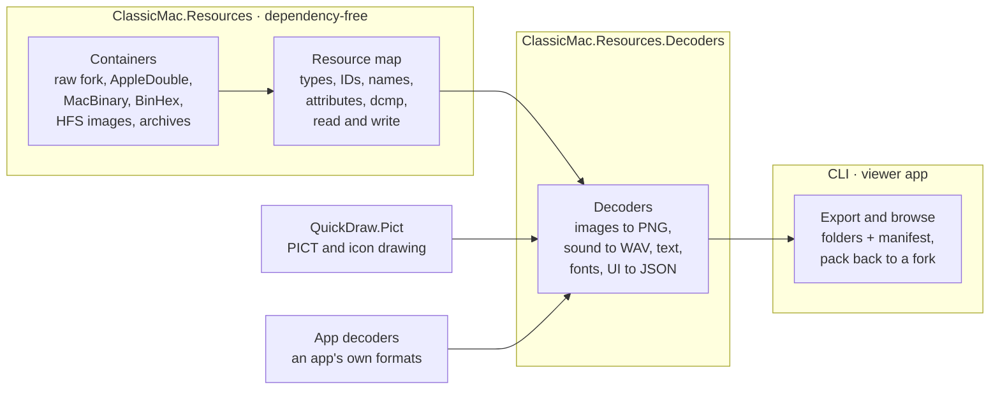

# ClassicMac — Project Plan

As of 2026-09-27.

## Purpose and goals

A .NET library, command-line tool and desktop app that gets the resources out of classic Mac OS files — whatever
they are wrapped in — and turns them into modern files with a manifest, and later edits and writes them back.

- **Reach the fork.** Read resource forks from raw forks, AppleDouble/AppleSingle, MacBinary, BinHex and, later, HFS
  disk images and old archives.
- **Decode, faithfully.** Convert each resource type to a modern format the way the Mac would have shown it: images
  through QuickDraw.Pict, sound to WAV, text to UTF-8, fonts, and UI resources to JSON.
- **Stay dependency-free at the core**, like QuickDraw.Pict, so other tools can embed it.
- **Stand alone.** A general tool for anyone working with classic Mac files; applications with their own formats
  extend it through custom decoders.

**Name and repository (decided):** the project is **ClassicMac**, in its own GitHub repo `inexin/ClassicMac` holding
the libraries, the CLI and the viewer/editor app. Packages: `ClassicMac.Resources`, `ClassicMac.Encodings`,
`ClassicMac.Resources.Decoders`, `ClassicMac.Resources.Cli`; the app carries the same name. QuickDraw.Pict stays a separate repo and package for now;
merging it into ClassicMac (as `ClassicMac.QuickDraw`) is the long-term intent.

## Inputs

Resource forks rarely survive on modern disks, so most of the value is in unwrapping the containers they travel in.
Proposed priority:

| Priority | Container | Typical source |
| --- | --- | --- |
| 1 | Raw resource fork (`.rsrc`, `file/..namedfork/rsrc` on macOS) | Extracted forks, macOS copies |
| 1 | AppleDouble (`._file`, `__MACOSX/` in zips) and AppleSingle | Files copied to FAT/SMB, zip archives |
| 1 | MacBinary I/II/III (`.bin`) | Downloads, archive sites |
| 1 | BinHex 4.0 (`.hqx`) | Usenet, old download sites |
| 2 | HFS and MFS disk images: raw `.dsk`/`.img`, DiskCopy 4.2, NDIF | Emulator disks, floppy images, CD-ROMs |
| 3 | HFS+ images | Mac OS 8.1–9 disks |
| 3 | StuffIt (`.sit`) and Compact Pro (`.cpt`) archives | Most classic Mac downloads |

Containers can nest (a `.hqx` holding a `.sit` holding a disk image), so input detection should recurse.

Every container yields the same *Mac file* entry: name (MacRoman), type and creator, Finder flags, creation and
modification dates (seconds since 1904, local time), data fork and resource fork. Single-file containers yield one
entry; disk images and archives yield a tree of them.

## Core: the resource map

The core reads a resource fork into an in-memory model and writes one back.

- **Model:** file → types → resources; each resource has type, ID, name, attributes (system heap, purgeable, locked,
  protected, preload, compressed) and its data.
- **Finder info:** the file's type, creator, flags and dates travel with the model into the manifest and back.
- **Compressed resources:** System 7's `dcmp` 0, 1 and 2 decompressed natively, following the System's own
  decompressors (disassembly) where the documentation is silent. Unknown `dcmp` IDs are kept compressed and flagged in
  the manifest.
- **API shape:** read from a `Stream`; resource data is read lazily from its offset, so large files and disk images
  stay cheap to open.
- **Tolerant reading:** truncated or overlapping entries go to a diagnostics list (severity, offset, message), not
  exceptions; only unusable input throws.
- **Writing:** rebuild a fork from the model, for modding and round-trip tests.
- **Text encodings:** MacRoman by default; the script of a file or of a font picks other Mac encodings (Japanese,
  Cyrillic, …). See [Text encodings](#text-encodings).
- **Untrusted input:** see [Hostile input](#hostile-input).

### Text encodings

.NET has no Mac encodings built in (`CodePagesEncodingProvider` must be registered and does not cover every Mac
script), so ClassicMac ships its own tables, generated from Unicode's published Apple mapping files (Unicode licence,
noted in `THIRD-PARTY-NOTICES.md`).

- **Core:** MacRoman and the single-byte Mac scripts (Central European, Cyrillic, Greek, Turkish, Icelandic, Croatian,
  Romanian, Symbol, Dingbats), small enough to keep the core dependency-free.
- **`ClassicMac.Encodings`:** the multi-byte scripts (Japanese, Traditional and Simplified Chinese, Korean), optional
  because their tables are large.
- **Choosing the script:** an explicit `--encoding` wins; otherwise the font's script (`FOND` family ID range), then
  the file's region (`vers`), then MacRoman. The choice is recorded in the manifest.
- MacRoman ↔ Unicode is lossless (every byte maps to one code point), so names and four-character codes stored as
  text round-trip exactly.

### Hostile input

The readers parse arbitrary downloaded files, so every size and offset is checked before use.

- **Bounds:** offsets and lengths are checked against the stream before reading; anything outside goes to diagnostics.
- **Allocation limits:** a per-resource ceiling on decompressed size (default 64 MiB, configurable); `dcmp` output
  must match the size its header declares; decoders check image dimensions before allocating.
- **Nesting and cycles:** container recursion stops at a depth limit (default 8); HFS B-tree and extent walks detect
  cycles.
- **Fuzzing:** SharpFuzz with libFuzzer on each container reader, the resource map and `dcmp`, seeded from the test
  fixtures; a short run on every CI build, a longer one nightly; crashes become regression fixtures.

## Decoders

Each decoder turns one resource type into a modern file; anything without a decoder is exported raw.

| Group | Resource types | Output |
| --- | --- | --- |
| Images | `PICT`, `ICON`, `ICN#`, `ics#`, `icl4/8`, `ics4/8`, `cicn`, `CURS`, `crsr`, `PAT `, `PAT#`, `ppat`, `SICN`, `icns` | PNG, via QuickDraw.Pict (screen depth selectable) |
| Sound | `snd ` (sampled formats 1/2; MACE 3:1/6:1, IMA4, µ-law) | WAV |
| Text | `STR `, `STR#`, `TEXT` + `styl`, `vers` | UTF-8 text / JSON; styled text as RTF or Markdown |
| Fonts | `sfnt`; `NFNT`/`FONT` + `FOND` | TTF; BDF or a PNG strike + metrics JSON |
| UI | `MENU`, `MBAR`, `DLOG`, `DITL`, `ALRT`, `WIND`, `CNTL` | JSON, optionally a rendered preview of the dialog |
| Colour | `clut`, `pltt` | JSON and `.act` palettes |
| Finder | `BNDL`, `FREF`, `SIZE` | JSON |
| Unknown | anything else, including `CODE` | raw `.bin` + hex preview in the manifest |

Disassembling `CODE` is out of scope; resource_dasm covers it.

App-specific types (a game's data records, an application's private resources) plug in as custom decoders
registered by the application.

## Output

One folder per input file, one subfolder per resource type, and a manifest that describes everything.

```
MyApp/
  manifest.json
  PICT/128 Title Screen.png
  snd%20/200 Door.wav
  STR#/1000 Messages.json
  CODE/1.bin
```

- **Images:** 32-bit RGBA PNG by default; `--depth` renders at a chosen screen depth (1, 2, 4, 8, 16 bit).
- **Round trip:** a `pack` command rebuilds a resource fork from the folder and manifest (below).

### Names on disk

Folder and file names must be valid and distinct on Windows, macOS and Linux. The manifest, not the name, is the
authority: `pack` reads type, ID and name from it, so escaping only has to be safe and readable, never reversible.

- **Resource files:** `<id> <name>.<ext>`, or `<id>.<ext>` when unnamed; the name is converted to Unicode through the
  file's encoding and cut so the whole path stays under 200 characters.
- **Escaping:** `%XX` (the byte in the file's encoding) for control characters, `% / \ : * ? " < > |`, and a trailing
  space or dot — so `snd ` becomes `snd%20` and `PAT ` becomes `PAT%20`.
- **Reserved Windows names:** a name that matches `CON`, `PRN`, `AUX`, `NUL`, `COM1`–`COM9` or `LPT1`–`LPT9`
  (ignoring case and extension) gets its last character escaped: `COM1` → `COM%31`.
- **Case collisions:** types are case-sensitive but Windows and macOS disks are not. When two types in one fork fold
  to the same name (`PICT` and `pict`, `snd ` and `SND `), each of them gets `~` and the type's hex bytes appended:
  `PICT~50494354`, `pict~70696374`. Types without a collision keep their plain name, so output stays readable.

### Manifest

`manifest.json` is a versioned format, because `pack` and other tools depend on it.

- **Schema:** a JSON Schema per major version in the repo (`schemas/manifest-1.schema.json`), referenced by the
  manifest's `$schema` and `formatVersion` fields. New optional fields are a minor change; anything else is a new
  major version. Readers reject a newer major version and ignore unknown fields.
- **Contents:** the source (container chain, file name), Finder info, encoding used, and diagnostics; then per
  resource: type (as text), ID, name, attributes, original size, `dcmp` ID if compressed, decoder and its version,
  output path (relative, `/`-separated), SHA-256 of the raw data and of the output file, and warnings.
- **Pack rules:** a file whose hash is unchanged takes the original raw data, from `raw/` (written by
  `extract --keep-raw`; three characters, so it never clashes with a type folder) or from the original fork given with
  `--base`; a changed file is re-encoded by its decoder's encoder, or is an error if there is none.
  Resources in the manifest with no file are dropped only with `--allow-deletes`.

## Architecture and packaging

Four packages and an app, layered so the core can be embedded anywhere and the heavy dependencies stay optional.



- **ClassicMac.Resources** — containers, the resource map and `dcmp`; no dependencies, .NET 10.
- **ClassicMac.Encodings** — the multi-byte Mac text encodings; optional, no dependencies.
- **ClassicMac.Resources.Decoders** — the built-in decoders; depends on QuickDraw.Pict for images.
- **CLI** — a `dotnet tool` with `list`, `extract` and `pack`.
- **Viewer app** — a cross-platform desktop app on the same packages (below).
- **Extension points:** an `IContainerReader` per container format and an `IResourceDecoder` per resource type, so
  apps add their own.
- **Own core (decided):** the resource map and disk-image layers are written here, because writing and exact Apple
  behaviour are needed throughout; ResourceForkReader, HfsReader and MfsReader (read-only) serve as cross-checks.

### Target layering after the QuickDraw.Pict merge

When QuickDraw.Pict moves into ClassicMac, it is split so every dependency points down: QuickTime and MacPaint stop
living inside PICT, and PICT calls QuickTime for its embedded images (`$8200`/`$8201`). Until the merge,
QuickDraw.Pict stays as it is.

| Layer | Contains | Depends on |
| --- | --- | --- |
| `ClassicMac.Graphics` (base) | The RGBA bitmap type, standard colour tables (`clut` 1–8, greys), PackBits, colour-table and PixMap reading | nothing |
| `ClassicMac.QuickTime` | ImageDescription, the codecs (`raw `, `rle `, `rpza`, `smc `, `cvid`, `8BPS`, `yuv2`, `YVU9`, `tga `), the codec plugin hook, QTIF files | Graphics |
| `ClassicMac.MacPaint` (or inside Graphics) | PNTG files and the `PNTG` codec's decoder | Graphics |
| `ClassicMac.QuickDraw` | PICT reading and writing, the drawing engine, regions, text, screen depths | Graphics, QuickTime |
| `ClassicMac.Resources` (+ `.Decoders`) | Resource forks and containers; icons, cursors and patterns become resource decoders here | Graphics, QuickDraw |
| ImageSharp plugins | One thin adapter per format | the layers above |

Colour tables and PixMaps sit in the base because QuickTime's codecs and QuickDraw both need them. At the merge,
`QuickDraw.Pict` and `QuickDraw.Pict.ImageSharp` are deprecated on NuGet, pointing to the new packages.

**Where icons live (settled by this layering):** icons, cursors and patterns are resources, so their decoders go in
`ClassicMac.Resources.Decoders`. Plain decoding (`ICN#`, `icl8`, `cicn`, …) needs only Graphics (colour tables,
PixMaps, masks); QuickDraw is needed only to scale them or draw them at a screen depth. The Icon Utilities rules that
QuickDraw.Pict's spec describes but never implemented move here too — suite member choice by size and depth, the
selected/disabled/label transforms, CalcMask, the `cicn` bitmap-or-pixmap rule — as does `icns` (Mac OS X icons).

### Viewer app

A desktop app for Windows, Linux and macOS to browse disk images, archives and files, and open their resource forks —
like ResEdit, read-only at first.

- **Framework:** [Avalonia](https://avaloniaui.net) — decided. The libraries are .NET, so the UI calls them directly
  with no bridge; one codebase ships as a self-contained download per OS (about 30–60 MB); it draws with Skia, so
  previews render pixel-identical everywhere. Rejected: Electron/Tauri (a web UI only pays off for a browser version,
  which the libraries could later reach through WebAssembly on their own), .NET MAUI (no Linux desktop), and a native
  UI per platform (three UIs).
- **Browse:** open a disk image, archive or file; a tree of volumes → folders → files, showing type/creator, dates and
  both forks; nested containers open in place.
- **Resources:** a file's resource fork as types → resources, with ID, name, size and attributes; search by type, ID
  or name.
- **Previews:** images (with a screen-depth switch), text, sound playback, font glyph sheet, dialogs drawn from
  `DLOG`/`DITL`, and a hex view for everything.
- **Export:** selected resources, a whole file or a whole volume, through the same code as the CLI; drag and drop out
  of the app.
- **Later:** editing, in stages (below), starting once `pack` round-trips cleanly.

**Structure:** the app adds nothing format-specific — it sits on the same `ClassicMac.Resources` and `Decoders`
packages as the CLI. MVVM with plain C# view-models (testable without a UI), one preview control per kind (image, hex,
text, sound, font, dialog) chosen by resource type, lazy opening and decoding so large disk images browse instantly;
sound playback is the only native dependency.

**First version:** read-only — open a file or disk image, browse the tree, preview images and hex, export. Other
previews arrive with their decoders.

**Editing, in three stages** — the viewer becomes an editor, ResEdit-style. Every save writes a verified round trip
(read back and compared) and keeps the original; undo within a session.

1. **Resource-level edits:** add, delete, duplicate, renumber and rename resources, change attributes, replace a
   resource's data from a file or the hex editor; save back into the same container (raw fork,
   AppleDouble/AppleSingle, MacBinary, BinHex).
2. **Typed editors:** forms for `STR `, `STR#`, `TEXT`/`styl`, `vers` and the UI templates (`DLOG`, `DITL`, `MENU`,
   …) with a live dialog preview; import PNG as PICT, icons and cursors, and WAV as `snd ` — which needs encoders in
   the libraries.
3. **Writing disk images:** add, replace and delete files in HFS images, with type/creator, dates and both forks.
   Archives (StuffIt, Compact Pro) stay read-only.

## Ground truth and licensing

Apple's documentation decides first; where it is silent or ambiguous, the answer comes from disassembling the Mac OS
code that handles the format (the Resource Manager, Sound Manager, Icon Utilities, HFS) — never from another
implementation's guess. A rule fitted to real data instead is marked as such.

- **Specs:** *Inside Macintosh: More Macintosh Toolbox* (resource format), *Inside Macintosh: Files* (HFS, MFS),
  *Sound* (`snd `), the Apple file-format notes for MacBinary, AppleSingle/AppleDouble and BinHex 4.0.
- **Behavioural references, not code to copy:** resource_dasm (MIT) and other open tools for container and `dcmp`
  edge cases.
- **Licence:** MIT, with third-party notices for anything ported; no Apple code or files in the repo.

### Testing

- **Fixtures in the repo are synthetic:** built by our own writer inside the tests, or from Rez source compiled with
  Apple's Rez through `mpw` (the output is ours, not an Apple file).
- **Rez fixtures are compiled locally, not in CI:** MPW is Apple software and never enters the repo or CI. The `.r`
  source and the compiled fork are both committed; a script regenerates them on a machine where `MPW_ROOT` points to
  an MPW install and records each source's hash beside its fork; CI checks the hashes so a stale fork fails the build.
- **Real-file corpus outside the repo:** system files, applications, games such as Realmz, shareware — found through
  an environment variable (`CLASSICMAC_CORPUS`); those tests skip when it is absent. Only hashes and manifests of
  corpus results are committed, never the files or their decoded output.
- **Checks:** round trip (read → write → read gives the same map, and unchanged forks are byte-identical); golden
  outputs for each decoder on the synthetic fixtures; corpus output diffed against resource_dasm and DeRez.
- **Tooling:** xUnit; CI on GitHub Actions for Windows, Linux and macOS.

### Prior art: Realmz.ResourceExtractor

The resource extractor in the Realmz project (a separate game reimplementation) is inspiration, not an authority: its
rules were written for Realmz's files and must be re-checked against Apple's documentation or the disassembly before
they are carried over. ClassicMac does not depend on Realmz; Realmz's data files are one of the test corpora, and the
Realmz project can serve as a real-world consumer to try the libraries against.

| Area | What it does today | Take from it |
| --- | --- | --- |
| Input | Raw resource-fork files (`.rsf`) only | The resource map reader, as a first draft |
| Resource map | Types, IDs, data; names not read; no `dcmp` | Needs names, attributes and compression |
| Images | PICT, `cicn`, icon lists and `icl`/`ics` with their masks, cursors with hotspots, `ppat` via QuickDraw.Pict | The icon-list pairing and the hotspot JSON |
| Sound | `snd ` formats 1/2, uncompressed PCM only (MACE and IMA4 throw) | The WAV writer; codecs still to do |
| Text | `TEXT` and `STR#` (JSON, 0-based) in MacRoman | The `STR#` layout |
| Fonts | `sfnt` → TTF, adding a Windows Unicode `cmap` and a missing `OS/2` table so modern loaders accept it | A "make it loadable" option for exported fonts |
| UI | `DLOG`, `DITL`, `WIND`, `CNTL`, `MENU`, `MBAR` → JSON | The field layouts, re-checked against *Inside Macintosh* |
| Output | A folder per category (`pictures/`, `sounds/`, …), 5-digit IDs, no manifest | Replace with per-type folders and a manifest |

### Prior art: other projects

No existing project combines containers, faithful conversion, writing and a cross-platform GUI — but each covers a
slice worth learning from. Licences matter: MIT code may be reused with notice; GPL and LGPL code is reference only.

| Project | Language, licence | Covers | Use for us |
| --- | --- | --- | --- |
| [ResourceForkReader](https://github.com/hughbe/ResourceForkReader) | C#, MIT; NuGet, active since 2025 | Reads raw forks; typed parsers for ~130 resource types; no `dcmp`, containers, conversion or writing | Cross-check record layouts and parsing |
| [HfsReader](https://github.com/hughbe/HfsReader) / [MfsReader](https://github.com/hughbe/MfsReader) | C#, MIT; NuGet | Read HFS and MFS disk images | Cross-check for the disk-image layer |
| [macresources](https://github.com/elliotnunn/macresources) | Python, MIT; dormant since 2020 | Rez-style text dumps, round trip, BinHex, `dcmp` 2 (GreggyBits) | Round-trip design; `dcmp` 2 reference |
| [machfs](https://github.com/elliotnunn/machfs) | Python, MIT | Reads and writes HFS volumes | Reference for writing HFS images |
| [resource_dasm](https://github.com/fuzziqersoftware/resource_dasm) | C++, MIT; very active | Decodes a very wide range of resource types to modern formats; `dcmp` via 68k emulation; disassembly | Widest coverage to compare output against |
| Claunia.RsrcFork (Aaru) | C#; NuGet, ~16k downloads | Resource fork reading for the [Aaru](https://github.com/aaru-dps/Aaru) preservation suite | Cross-check; Aaru for disk-image formats |
| [HFSExplorer](https://github.com/unsound/hfsexplorer) | Java, GPL-3 | GUI browser for HFS/HFS+ images, extracts both forks | UX reference for the viewer |
| [XADMaster](https://github.com/MacPaw/XADMaster) | C/Objective-C, LGPL-2.1 | The Unarchiver's engine: StuffIt, Compact Pro, BinHex, MacBinary | Reference for archive formats |
| [mpw](https://github.com/ksherlock/mpw) | C | Runs Apple's MPW tools (Rez, DeRez) on modern systems | Ground truth: compile/decompile with Apple's own Rez |
| [ResourceForker](https://github.com/csammis/ResourceForker) | C; dormant since 2016 | Small utilities to split resource forks | Minor reference |

## Phases

Each phase ships something usable and ends when its exit check passes; no dates set yet.

1. **Core** — resource map read/write, `dcmp` 0/1/2, Finder info, raw forks, AppleDouble/AppleSingle, MacBinary,
   BinHex; CLI `list` and raw `extract`. *Exit:* read → write is byte-identical on the corpus forks.
2. **Disk images** — HFS and MFS (raw, DiskCopy 4.2, NDIF), recursive unwrapping. *Exit:* every file of the corpus
   images lists and extracts with both forks and Finder info.
3. **Decoders I** — images through QuickDraw.Pict; text (`STR `, `STR#`, `TEXT` + `styl`, `vers`); `snd ` to WAV
   including MACE and IMA4; the manifest. *Exit:* golden outputs pass and the corpus exports without errors.
4. **Viewer app** — read-only: browse disk images, files and resources with previews and export; grows with later
   decoders.
5. **Decoders II** — UI resources to JSON and dialog previews, then fonts; palettes and Finder resources; `pack`.
   *Exit:* extract → `pack` is byte-identical for unchanged resources.
6. **Editor I** — resource-level edits and saving back into forks and single-file containers.
7. **Editor II** — typed editors and PNG/WAV import (image and sound encoders).
8. **Editor III** — writing HFS disk images.
9. **Merge** — QuickDraw.Pict moves into the ClassicMac repo, split into the target layering (Graphics, QuickTime,
   MacPaint, QuickDraw); the old packages are deprecated.
10. **Later** — HFS+, StuffIt and Compact Pro.

## Decisions

- **Name:** ClassicMac (see Purpose and goals).
- **Repository:** a new repo, `inexin/ClassicMac`; QuickDraw.Pict stays separate for now, to be merged in later.
- **UI framework:** Avalonia (see Viewer app).
- **Own core:** written here rather than built on ResourceForkReader/HfsReader, which are read-only; they serve as
  cross-checks.
- **Target framework:** .NET 10 (LTS; .NET 8 support ends November 2026).
- **Disk images early:** phase 2, right after the core, because much classic software survives only as disk images.
- **Decoder priority after images:** text, sound, UI, fonts.
- **Image output:** 32-bit RGBA PNG by default; other screen depths on request.
- **Editing order:** resource-level edits, typed editors, then writing disk images.
- **Names on disk:** `%XX` escaping, reserved-name escaping, hex suffix on case collisions; the manifest is the
  authority (see Names on disk).
- **Manifest:** versioned JSON Schema; hashes decide what `pack` re-encodes.
- **Encodings:** own tables from Unicode's Apple mappings; single-byte in the core, multi-byte in
  `ClassicMac.Encodings`.
- **Hostile input:** bounds checks, allocation and nesting limits, fuzzing in CI.

## Open questions

None at present.
