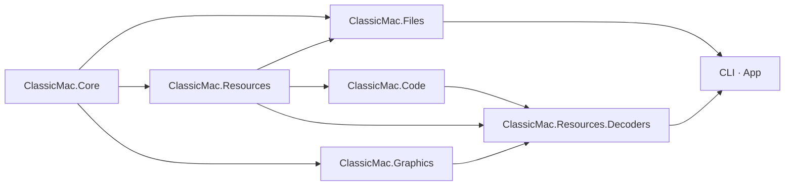

# ClassicMac — Project Plan

As of 2026-10-04. This is the plan and the record of decisions; how each format is read and written is in
[`docs/formats/`](formats/README.md), the command line in [`cli.md`](cli.md), the code rules in `CLAUDE.md` (and each project's own), the app's
design in `design/APP-DESIGN-BRIEF.md`. Finished work is summarised here, not narrated: git history has the detail.

## Goals

A .NET library, command-line tool and desktop app that reads, converts and edits classic Mac OS files: resource forks
and the containers they travel in, disk images and archives, resources decoded to modern formats, and code.

- **Reach the fork**, whatever wraps it: single-file wrappers, host folders, disk images, CDs, archives, nested.
- **Decode faithfully**: exactly what a Mac showed or played (QuickDraw pixels, Sound Manager samples, Font Manager
  choices), with the Mac's quirks reproduced.
- **Write back**: resource forks, single-file containers and HFS volumes, every save verified.
- **Stay embeddable**: dependency-free libraries; applications add container readers and resource decoders.

## Where things stand

| Area | State | Specs |
| --- | --- | --- |
| Resource forks | Read and written (canonical, as the Resource Manager compacts), `dcmp` 0–3, the Mac OS 9 and 68k ROM models | resources/resource-fork.md, compressed-resources.md |
| Single-file wrappers and host folders | AppleSingle/Double, MacBinary I–III, BinHex, uuencode, Basilisk II, PC Exchange; read and written | containers/ |
| Disk images | HFS, MFS, HFS Plus/HFSX (plain and wrapped), partition maps, Disk Copy 4.2, NDIF, DART, UDIF, ISO 9660/High Sierra, raw CD and cue sheets, FAT with DOS partitions, DiskDup+, ROM images | file-systems/, disk-images/ |
| Archives | StuffIt 1–5 and segments, Compact Pro, DiskDoubler, PackIt, LHA, zip/tar/gzip with Mac data, `.sea` | archives/ |
| Writing HFS | Plain HFS volumes, also in a partition map (each partition by its name when there are several), Disk Copy 4.2 and NDIF: files and folders added, deleted, renamed, moved, locked, blessed, Finder info and forks set, `format`, `resize` (growing, past 65,535 blocks with a new block size, and shrinking); edited through a sector overlay, saved verified | hfs.md §3, §5.5 |
| First Aid | HFS, HFS Plus and HFSX (plain, wrapped, journaled) checked and repaired: `check`, `repair`, Volume ▸ First Aid…; HFS checked live against Disk First Aid 8.5.5 | hfs.md §5.6, hfs-plus.md §5.4 |
| Decoders | Images (PICT, icons, cursors, patterns), sound (`snd ` with MACE, IMA4, µ-law), text and styled text, fonts, UI resources with previews, palettes, Finder resources, aliases, documents (DOCMaker, SimpleText, Word 4/5/6/98, help pages) to HTML, code | resources/, documents/, output/ |
| Graphics | `ClassicMac.Graphics`: QuickDraw renderer (two QuickDraws, screen depths), PICT read and write, QuickTime images, MacPaint, fonts; ImageSharp and SkiaSharp adapters | graphics/ |
| Code | PEF, `cfrg`, 68k applications, data initialisers, code resources; 68k and PowerPC disassemblers; `disasm` | code/, output/disassembly.md |
| CLI | `info`, `list`, `unpack`, `extract`, `convert`, `disasm`, `pack`, the Mac-path commands (`ls`, `stat`, `cat`, `find`, `get`), the write commands, `check`, `repair`, `format`, `resize`, `shell`, `mcp` | cli.md |
| App | Avalonia viewer and editor: browse, previews (images, sound, text, fonts, dialogs, menus, Finder windows, documents, listings, hex), export, resource edits with undo, typed forms and templates, image and sound import, the Volume menu with First Aid, Defragment and Resize in their own dialogs (progress, Cancel), the Volume card's allocation map | design/APP-DESIGN-BRIEF.md, design/boards/volume-tools.md |

Phases 1–11 (core, disk images, decoders I and II, viewer, editors I–III, the QuickDraw.Pict merge, HFS Plus and
archives, code) are done and passed their exit checks.

## Architecture

- **ClassicMac.Core**: `FourCC`, `MacString`, `MacDate`, geometry, `Fixed`, `Diagnostic`, Mac OS Roman, host-safe
  names, `BigEndianReader`/`Writer`; no dependencies.
- **ClassicMac.Files**: the Mac file model (`MacFile`, `FinderInfo`, lazy `ForkData`), `ContainerUnwrapper`, and a
  namespace per area: `.Containers`, `.Hfs` (HFS, MFS, HFS Plus, disk images, the writer, First Aid), `.Fat`, `.Iso`,
  `.Archives`, `.Compression`, `.Checksums`, `.Editing` (`InputEditSession`), `.Export`. References Resources (NDIF
  keeps its layout in resources), never the reverse.
- **ClassicMac.Resources**: the resource map, `dcmp`, editing (`EditSession`), export and the manifest.
- **ClassicMac.Graphics**: one package in layers, each using only those below (checked by `LayeringTests`): base
  (bitmaps, colour tables, MacPaint), `.Fonts`, `.QuickTime`, `.QuickDraw` (the public `QuickDrawPort`), `.Pict`.
- **ClassicMac.Code**: `.Ppc`, `.M68k`, `.Disassembly`.
- **ClassicMac.Resources.Decoders**: the built-in decoders, a namespace per area.
- **CLI** (`classicmac`, System.CommandLine; `mcp` on `ModelContextProtocol.Core`) and the **App** (Avalonia,
  CommunityToolkit.Mvvm, SoundFlow for playback, NativeWebView for HTML) add nothing format-specific.
- **Extension points**: `IContainerReader`, `IResourceDecoder`, `IResourceDecompressor`, `IPictImageCodec`,
  `ITextFallback`.
- **Build**: .NET 10, `ClassicMac.slnx`, central package versions, warnings and the recommended analyzers as errors,
  AOT-compatible libraries; xUnit v3; CI on Windows, Linux and macOS for every push.

## Principles

- **Ground truth**: Apple's documentation first; where it is silent, the Mac OS code that handles the format
  (disassembly), checked in SheepShaver; other implementations are behavioural references only. Rules fitted to data
  are marked. Each spec in `docs/formats/` tags every rule with its source and changes with the behaviour.
- **Reference build**: "Mac OS 9" is Mac OS 9.0; its quirks are reproduced. The 68k ROM ($077D) is a selectable model
  where it differs (QuickDraw, the Resource Manager).
- **Licensing**: MIT; code ported from MIT projects keeps a notice in `THIRD-PARTY-NOTICES.md`; GPL, LGPL, AGPL and
  APSL code is reference only. No Apple code or files in the repository.
- **Hostile input**: every size and offset checked, by what is present rather than what a header declares; limits
  on nesting, expansion, decompressed size and pixels; cycles detected; only `InvalidDataException` and
  `EndOfStreamException` escape (and the exceptions an API documents, such as `PictReader`'s
  `NotSupportedException`), and nothing runs long (the mutation tests, and the nightly fuzzing of `tools/Fuzz`).
- **Configuration**: no tunable value hard-coded; immutable options records (`ContainerReadOptions`, `ReadOptions`,
  `DecodeOptions`, `ExportOptions`, `HostWriteOptions`, `PackOptions`) with a static `Default`, mapped by the CLI and
  the app.
- **Writing**: the source is never changed unless asked (`--in-place`, Save); every save is written aside, read back,
  verified, then moved into place; the first in-place save keeps `.orig`.
- **Testing**: test-first; fixtures are synthetic (built by builders in the tests) or redistributable samples; real
  files stay outside the repository in corpora named by `CLASSICMAC_CORPUS`, `CLASSICMAC_CODE_CORPUS` and
  `CLASSICMAC_HFSPLUS_REFERENCE_IMAGE`, whose tests skip without them and commit only names, counts and hashes.
  Golden outputs and the corpus export baseline pin decoded output; screenshot baselines pin the app.

## Decisions

Standing decisions, with their dates; superseded ones are dropped.

- **Name and repository**: ClassicMac, `inexin/ClassicMac`; QuickDraw.Pict moved in with its history (2026-09-29) as
  `ClassicMac.Graphics`, its old packages to be deprecated when the new ones are published.
- **Own core**: written here, not on ResourceForkReader/HfsReader (read-only); they are cross-checks.
- **Packages** (2026-10-06): five, plus the CLI as a .NET tool: `ClassicMac.Formats` (carrying the Resources, Files, Code and
  Resources.Decoders assemblies, which stay separate projects with their own layers), `ClassicMac.Core`,
  `ClassicMac.Graphics` (usable on its own, as QuickDraw.Pict was) and one integration package per host library
  (`.ImageSharp`, `.SkiaSharp`). Assemblies are named after the Apple technology, a namespace per area.
- **Resource forks**: written as the Resource Manager's compaction leaves them; duplicates keep the first, as
  `GetResource` does; Mac OS 9's model by default, the ROM's on request.
- **Output**: a folder per file, a folder per type, `%XX`-escaped names, a versioned manifest (JSON Schema) that
  `pack` trusts over names; images 32-bit RGBA PNG by default, other screen depths on request.
- **Encodings**: own tables from Unicode's Apple mappings; single-byte in Core, multi-byte in an optional
  `ClassicMac.Encodings`.
- **Renderer and file format**: separate layers; a public `QuickDrawPort` with QuickDraw's names (2026-09-29).
- **Documents**: previewed through their HTML export in the platform's web view (2026-10-03); help pages likewise.
- **Kinds**: named the Finder's way from what is on the volume, then ClassicMac's own table, then TCDB (shipped,
  the owner's decision of 2026-10-03; a user's own copy replaces it).
- **Aliases**: one resolver (`AliasResolver`) for the CLI, MCP and the app, following the Alias Manager's fast search
  (2026-10-03).
- **Templates**: ClassicMac ships its own for common types without a form; ResEdit's `TMPL`s are never copied; a
  `TMPL` in an open file wins (2026-10-02).
- **File commands**: one command core on Mac paths in the library, with three front ends: CLI subcommands with
  stable `--json`, an MCP server and a DOS-like shell (2026-10-03).
- **HFS editing**: through a sector overlay (`HfsVolume`), never whole images; catalog edits as Mac OS makes them;
  `resize` grows within the block size only (2026-10-03).
- **First Aid** (2026-10-04): a better check and repair, not a faithful copy of Disk First Aid. Its stages, numbers and
  words are kept where they serve; checks it lacks count in the same verdict; where it gives up (no alternate MDB) the
  primary is used. HFS Plus is checked by TN1150's rules, its journal replayed first.
- **Archives without a spec**: decompressors written here and verified against archives the real applications made;
  XADMaster and macutils are reference only.
- **Inputs on request only**: StuffIt X and other encrypted formats, PackageIt, Now Compress, MOOF, CHD, Apple II;
  Mac OS X sparse images are out of scope.

## Open work

In rough priority; each item names what blocks it, if anything.

1. **HFSX live**: HFS passes Disk First Aid 8.5.5 live (27 repaired faults, clean disks), HFS Plus repairs on Mac OS
   9-made volumes pass it too, and so do edits with overflow extents, writes to several partitions, and new and edited
   NDIF images (mounted in Disk Copy 6.3.3). HFSX has been tried only on built volumes: it needs Mac OS X 10.3 or later
   (fsck_hfs), which the harness does not have.
2. **Fuzzing**: `tools/Fuzz` runs libFuzzer through SharpFuzz nightly (`.github/workflows/fuzz.yml`, five minutes a
   target) on fifteen targets: containers, resource forks, single resources through every decoder, 68k and PowerPC
   code, PEF, PICT on both QuickDraws, TIFF, WAV and First Aid; and the writers, where the input chooses what is
   written and it must read back as meant (any refusal of their own output a crash): the NDIF writer (any disk made
   into an image, rewritten and split), HFS edits (up to 24 edits on a new volume, defragmenting and resizing among
   them, each followed by the writer's checks, First Aid and a comparison with a model of the files and folders), First
   Aid's repairs (a valid HFS or HFS Plus volume damaged in its metadata: a volume called repaired must verify, read
   cleanly and need no second repair), the edit session (HFS volumes plain, partitioned or in a Disk Copy 4.2 image,
   through every edit it makes, checked as the input stands), the wrappers (MacBinary III, AppleSingle, BinHex, resource
   forks, DeRez and Rez, ADC, KenCode, PackBits) and PICT (PictWriter in every pixel format, and recordings on both
   QuickDraws drawing what the port drew). A reader fault the unwrapper or a decoder reports (`*-fault`) counts as a
   crash. Seeds are the repository's test files and what is inside them, and HFS and HFS Plus volumes (plain and
   wrapped) and PEF containers from the tests' builders; each target's corpus is minimised and kept in the Actions
   cache between runs. Crashes are kept as artifacts and replayed with `Fuzz replay`; those found so far are tests.
   The seeded mutation
   tests (`tests/Shared/Mutations.cs`) stay in the suite; `CLASSICMAC_MUTANTS` runs them deeper.
3. **App**: releases are built by `release.yml` on a version tag ([releasing.md](releasing.md)): self-contained
   archives for Windows, macOS (`.app` with its icon) and Linux (icons, `.desktop`, `install.sh`). Still to do: signing
   (Apple Developer ID and notarization, a Windows code-signing certificate) and installers (`.dmg`, `.msi`).
4. **Samples wanted** (no original yet): StuffIt method 6 and 5's method 14, a SegmentIt set, PackIt `PMa4` and
   encrypted entries, DiskDoubler methods 2–5 and 7 and the delta types; fast-saved Word 6 documents and a Word 98
   fast save with a Prm; a Mac-made zip; Mac OS X-made `.dmg`; NDIF version 2 and chunk type `$F0`; 68k ROM images;
   PEF section kinds 5, 6, 8 and CFM-68K; THINK C code. PCE MAR is blocked (no sample; layout only in GPL source).
5. **Owner's steps**: publish the NuGet packages, then deprecate the QuickDraw.Pict ones.
6. **Rez** (CLI only, not in the app until asked for): typed `resource` statements and the preprocessor; `rez` compiles
   `data`, `read` and `include` as MPW does, and `derez` writes MPW DeRez's output byte for byte.
7. **Comparisons, optional**: corpus output against resource_dasm; Rez-compiled fixtures (MPW kept out of
   the repository and CI, the forks pinned by hash).

## Ideas

- **Runtime** (`ClassicMac.Runtime`, not started): run classic 68k applications without Apple's ROM or System, by
  high-level emulation as Executor does: a 68k interpreter (ported from an MIT core), an A-trap dispatcher and
  low-memory globals generated from Multiversal Interfaces, then the Memory Manager, Segment Loader and Resource
  Manager, a headless harness logging traps, and the Toolbox managers trap by trap over the existing QuickDraw, fonts,
  resources and file systems. PowerPC later, through a ClassicMac `InterfaceLib`. Inside Macintosh and the Mac OS 9
  harness decide behaviour; Executor (MIT-style) guides, Advanced Mac Substitute and the GPL emulators are reference
  only.

## Prior art

No other project combines containers, faithful conversion, writing and a GUI; these cover slices. MIT code may be
ported with notice; GPL and LGPL code is reference only.

| Project | Licence | Use |
| --- | --- | --- |
| resource_dasm | MIT | Widest decoder coverage to compare against; its `dcmp` 3 and disassembler decoding were ported |
| ResourceForkReader, HfsReader, MfsReader, StuffItReader (hughbe) | MIT | Cross-checks |
| macresources, machfs (Elliot Nunn) | MIT | Round-trip and HFS writing references |
| DiscUtils | MIT | FAT, ISO, HFS Plus and UDIF cross-checks |
| deark, CiderPress2 | MIT-style, Apache-2.0 | Archive and Apple II references, portable with notice |
| Executor 2000 | MIT-style | The Runtime idea's guide |
| XADMaster, macutils, Aaru, HFSExplorer, dmg2img, libdmg-hfsplus, Linux HFS Plus, `fsck_hfs` | LGPL, GPL, APSL or unclear | Reference only |
| mpw | — | Runs Apple's Rez and DeRez for ground truth, outside the repository |
